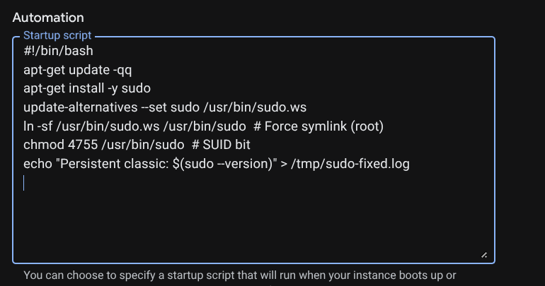
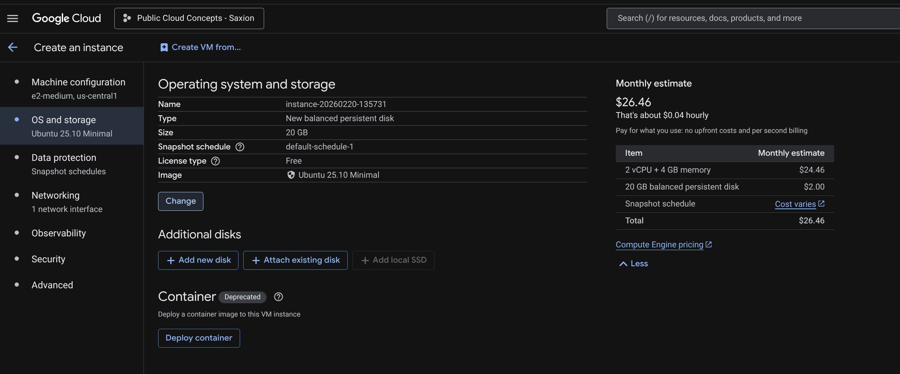
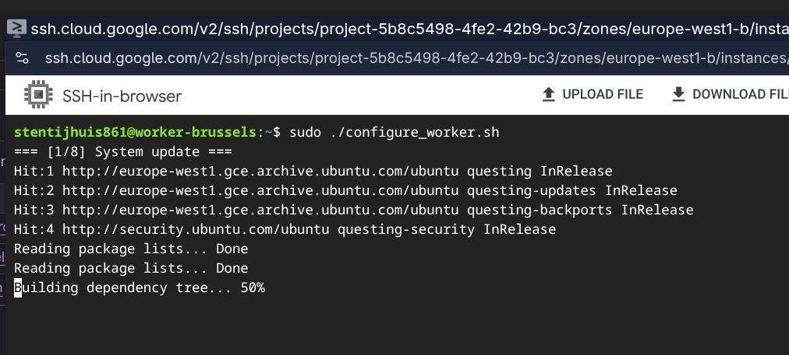
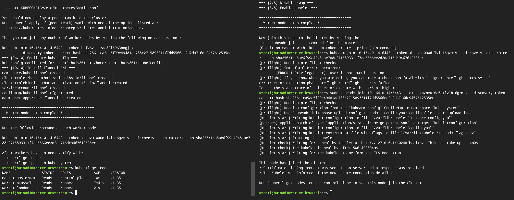
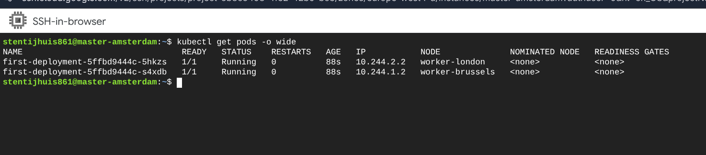
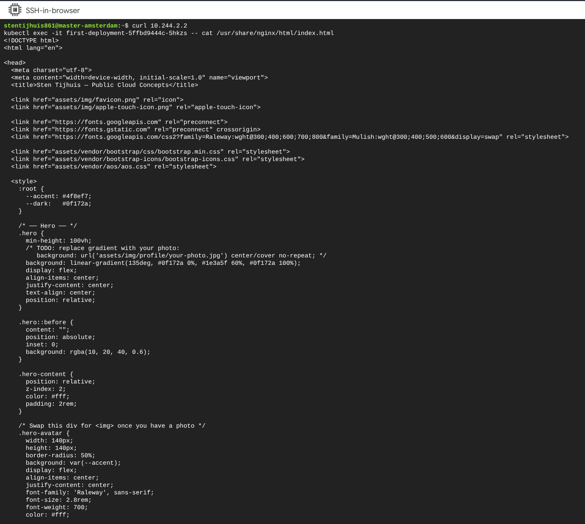

[Nederlands](README.md) | English

---

> [!NOTE]
> This repository is maintained primarily in **Dutch**. This English version may be incomplete or outdated. An English translation may be added in the future, but is not guaranteed.

# Week 1 - Introduction to Google Cloud & Kubernetes

---

# Assignments

## 1.1 Google Cloud & Google Kubernetes Engine (GKE)

This week you will be introduced to the Google Cloud Platform. We will learn the basic concepts of Google Cloud and the most important Google services.

If you already have a basic understanding of Public Cloud Concepts, you may skip the first two basic courses.

- Complete the course **Essential Google Cloud Infrastructure: Core Infrastructure**
  https://www.cloudskillsboost.google/course_templates/60

- Complete the course **Essential Google Cloud Infrastructure: Core Services**
  https://www.cloudskillsboost.google/course_templates/49

Now you have a basic understanding of Google Cloud, let's jump into Google Kubernetes Engine (GKE).

- Complete the course **Getting Started with Google Kubernetes Engine**, incl. labs (12 credits):
  https://www.cloudskillsboost.google/paths/11/course_templates/2

You need to add the Proof of Completion (Course Badge) badges to your portfolio.

---

## 1.2 Kubernetes Challenge

To complete the first week's assignment, we want to apply the knowledge of Kubernetes and gain more in-depth knowledge.

We need a Kubernetes cluster for that. We are going to install a full cluster on **Ubuntu minimal 24.04 LTS** instances (1 masternode and 2 workernodes) with `kubeadm`.

Also study the relevant topics from the ebook *Production Kubernetes* (see Brightspace).

### Assignment 1 - Installing the Kubernetes Cluster

**Prerequisites (per node):**

- An Ubuntu 24.04 LTS minimal system
- Privileged access to the system (root or sudo user)
- Active internet connection
- Minimum 4 GB RAM
- Minimum 2 CPU cores (or 2 vCPUs)
- 20 GB of free disk space on `/var` (or more)

1. Create three Ubuntu 24.04 LTS minimal instances in Google Cloud (type `e2-standard-2`). To see that a virtual network in Google directly connects multiple regions, place:
   - the **master** in the Netherlands
   - a **node** in Brussels
   - a **node** in London

   Install a Kubernetes master and 2 Kubernetes workernodes.
   A good guide: https://hbayraktar.medium.com/how-to-install-kubernetes-cluster-on-ubuntu-22-04-step-by-step-guide-7dbf7e8f5f99

   > **Use the Flannel CNI** - otherwise the communication between pods on different nodes may not work.

   The bash scripts `Installmastertemplate` and `installnode` are provided (see files in this directory). `Installmastertemplate` still needs to be modified (uncomment the correct lines as indicated at the top of the file) and then run on the master. `installnode` must be executed on the nodes.

   After this, the nodes must be added to the cluster with the command visible on the master after executing the script: `sudo kubeadm join....`
   If it is not visible, run on the master: `kubeadm token create --print-join-command`

   Explain what the `kubeadm init` command does (and why it only needs to be done on the master) and explain what the following command does (the CNI must be installed on the master after the nodes are added):
   ```
   kubectl apply -f https://raw.githubusercontent.com/flannel-io/flannel/master/Documentation/kube-flannel.yml
   ```
   What other network CNIs are there?

   **a)** Once installed, you should have a well-functioning cluster. First check that on the master with:
   ```
   kubectl get nodes
   kubectl get pods -n kube-system
   ```
   Explain these pods using the diagram from the book *Production Kubernetes*.

### Assignment 2 - Running a Containerized Application

We now want to run a containerized application in this cluster. A `Dockerfile` and `index.html` file are provided (see files in this directory).

Examine the Dockerfile and explain how the application is built and what it does.

We use GitHub to automatically create an image when the code (`index.html`) is modified and the image is then stored in DockerHub. After that, we can run the image in the Google Kubernetes cluster.

2. Create a repository in GitHub (e.g. called `container`). Make sure git is installed on your PC and clone the GitHub repository to your own PC and place the `Dockerfile` and the `index.html` file there.

   Also create a repository in DockerHub where the docker image should be placed after a build.

   Create a workflow in GitHub that builds a new image when the Dockerfile is modified and uploads it to the newly created DockerHub repository. Start with the `blank.yml` workflow found at https://github.com/actions/starter-workflows/tree/main/ci

   Customize this workflow so that the final steps look like this:

   ```yaml
   steps:
     - uses: actions/checkout@v4

     - name: Login to Docker Hub
       uses: docker/login-action@v2
       with:
         username: ${{ secrets.DOCKER_USERNAME }}
         password: ${{ secrets.DOCKER_PASSWORD }}

     - name: Build and push Docker image
       run: |
         docker build -t <dockerhubaccountname>/<repository>:latest .
         docker push <dockerhubaccountname>/<repository>:latest
   ```

   Make sure that the secrets are set in GitHub (Settings -> Secrets and Variables -> Actions -> Repository Secrets) and that the Docker account and repository are adjusted.

   Commit the files `Dockerfile` and `index.html` to your PC and push it to GitHub. The workflow should now be kicked off so that a Docker image is created in the DockerHub repository.

   We now want to run this image (which is a web application) in a pod in Kubernetes. Create a `Deployment.yaml` file for the newly created image (e.g. create 2 replicas). The first part of this file looks like this:

   ```yaml
   apiVersion: apps/v1
   kind: Deployment
   metadata:
     name: myfirst-deployment
   spec:
     replicas: 1  # Number of instances (pods) to run
     selector:
       matchLabels:
         app: my-container
   # everything under template is the definition of the pod that will be created.
     template:
       metadata:
         labels:
           app: my-container
       spec:
         containers:
         - name: web-app
           image:
   ```

   **a)** Study the structure of this file and explain the various parts. Complete the deployment file by filling in the image and adding which port to use (port 80). Create two pods using the deployment file with `kubectl apply -f`.

   **b)** Investigate whether the pods are running and investigate the IP address of the newly created pods. Access the web server in the pod by issuing `curl <ip-pod>` from a node where a pod is running. Show what the output is.

   **c)** Also, log in to the pod from the master with `kubectl exec` and verify that the directory `/usr/share/nginx/html/` exists, and use `cat` to view the contents of `index.html`.

---

# Learning Materials

### Google Cloud

| Resource | Link |
|---|---|
| A Tour of Google Cloud Hands-on Labs (GSP282) | [cloudskillsboost.google](https://www.cloudskillsboost.google/focuses/2794?parent=catalog) |
| Google Cloud Fundamentals - Core Infrastructure | [cloudskillsboost.google](https://www.cloudskillsboost.google/course_templates/60) |
| Essential Google Cloud Infrastructure - Core Services | [cloudskillsboost.google](https://www.cloudskillsboost.google/course_templates/49) |
| Google Compute Engine documentation | [cloud.google.com](https://cloud.google.com/compute?hl=en) |

### Kubernetes

| Resource | Link |
|---|---|
| Getting Started with Google Kubernetes Engine | [cloudskillsboost.google](https://www.cloudskillsboost.google/paths/11/course_templates/2) |
| Google Kubernetes Engine documentation | [cloud.google.com](https://cloud.google.com/kubernetes-engine/docs/concepts/kubernetes-engine-overview) |
| Kubernetes documentation | [kubernetes.io](https://kubernetes.io/docs/home/) |
| Kubernetes cluster on Ubuntu (step-by-step guide) | [hbayraktar.medium.com](https://hbayraktar.medium.com/how-to-install-kubernetes-cluster-on-ubuntu-22-04-step-by-step-guide-7dbf7e8f5f99) |

---

# Files in This Directory

| File | Description |
|---|---|
| [Dockerfile](Dockerfile) | Docker image definition for the Week 1 application |
| [deployment.yml](deployment.yml) | Kubernetes Deployment manifest |
| [service.yml](service.yml) | Kubernetes Service manifest |
| [index.html](index.html) | Static HTML page served by the container |
| [Installmastertemplate](Installmastertemplate) | Script template for setting up the Kubernetes master node |
| [installnode](installnode) | Script for setting up a Kubernetes worker node |

---

---

# My Work

## 1.1 Google Cloud & GKE - Completed Badges

Completed badges via [Google Cloud Skills Boost](https://www.skills.google/public_profiles/d92d9d25-7174-4f3a-8f70-fab880429afe):

[](https://www.skills.google/public_profiles/d92d9d25-7174-4f3a-8f70-fab880429afe)
[](https://www.skills.google/public_profiles/d92d9d25-7174-4f3a-8f70-fab880429afe)
[](https://www.skills.google/public_profiles/d92d9d25-7174-4f3a-8f70-fab880429afe)

---

## 1.2 Kubernetes Challenge

### Assignment 1 - Cluster Installation

> **Note:** The assignment specifies Ubuntu 24.04 LTS minimal. I used **Ubuntu 25.10 LTS minimal** instead.
>
> Ubuntu 25.10 ships with `sudo-rs` (a Rust reimplementation of sudo) version 0.2.8 by default, as confirmed below:
>
> 
>
> This version has a known session bug. For example, running `sudo reboot` would fail with an unexpected error instead of rebooting:
>
> 
>
> This was resolved by configuring a GCP startup script ([AUTOSTART-configure_classic_sudo.sh](AUTOSTART-configure_classic_sudo.sh)) that installs classic `sudo` on every boot, replacing `sudo-rs`:
>
> 

**Instances used:**

| Node | Name | Zone | Type | OS |
|------|------|------|------|----|
| Master | master-amsterdam | europe-west4-a (Netherlands) | e2-medium | Ubuntu 25.10 LTS minimal |
| Worker 1 | worker-brussels | europe-west1-b (Belgium) | e2-medium | Ubuntu 25.10 LTS minimal |
| Worker 2 | worker-london | europe-west2-b (United Kingdom) | e2-medium | Ubuntu 25.10 LTS minimal |




The cluster was installed using two custom shell scripts: [`configure_master.sh`](configure_master.sh) for the master node and [`configure_worker.sh`](configure_worker.sh) for the worker nodes. These scripts automate all steps: kernel module configuration, containerd installation, Kubernetes package installation (v1.35), and cluster initialization.




After both workers completed the script, they were joined to the cluster using the `kubeadm join` command printed by the master. The screenshot below shows the full Flannel installation, both workers joining, and the final `kubectl get nodes` confirming all three nodes are `Ready`:



**Explanation of `kubeadm init`:**

`kubeadm init` bootstraps the Kubernetes control plane on the master node. It generates all TLS certificates (for the API server, etcd, and kubelet communication), writes kubeconfig files, deploys the static Pod manifests for the core control-plane components (kube-apiserver, kube-controller-manager, kube-scheduler, etcd), and creates a bootstrap token that worker nodes use to join the cluster. It is only run on the master because the master is the only node that hosts the control plane. Worker nodes do not run the API server or etcd, they only run workloads via kubelet.

**Explanation of `kubectl apply -f kube-flannel.yml`:**

This command installs Flannel as the Container Network Interface (CNI) plugin. Kubernetes itself does not provide pod-to-pod networking, it delegates that to a CNI plugin. Flannel creates an overlay network (VXLAN by default) that gives every pod a unique IP address and ensures pods on different nodes can communicate directly with each other, even across regions. The `apply -f` command reads the Flannel manifest from the URL and creates all required resources: a DaemonSet (so Flannel runs on every node), a ConfigMap with the network configuration (CIDR `10.244.0.0/16`), and the necessary RBAC rules. The CIDR must match the `--pod-network-cidr` flag passed to `kubeadm init`.

**Other network CNIs:**

| CNI | Description |
|-----|-------------|
| **Flannel** | Simple L3 overlay network using VXLAN. Easy to set up, no network policy support. |
| **Calico** | Feature-rich CNI with BGP routing and full NetworkPolicy support. Common in production. |
| **Cilium** | eBPF-based CNI with advanced observability and security features. |
| **Weave Net** | Mesh overlay network, easy setup, supports NetworkPolicy. |
| **Canal** | Combines Flannel (networking) with Calico (network policy). |

**1a - Output of `kubectl get nodes`:**

```
NAME               STATUS   ROLES           AGE    VERSION
worker-brussels    Ready    <none>          14m    v1.35.1
worker-london      Ready    <none>          7m     v1.35.1
master-amsterdam   Ready    control-plane   17m    v1.35.1
```

**Output of `kubectl get pods -n kube-system`:**


```
NAME                                          READY   STATUS    RESTARTS   AGE
coredns-7d764666f9-fxf8b                      1/1     Running   0          17m
coredns-7d764666f9-hk9mj                      1/1     Running   0          17m
etcd-master-amsterdam                         1/1     Running   0          17m
kube-apiserver-master-amsterdam               1/1     Running   0          17m
kube-controller-manager-master-amsterdam      1/1     Running   0          17m
kube-proxy-gkbv7                              1/1     Running   0          17m
kube-proxy-jpjhp                              1/1     Running   0          14m
kube-proxy-xfg9q                              1/1     Running   0          7m23s
kube-scheduler-master-amsterdam               1/1     Running   0          17m
```

> **Note:** The `kube-flannel` pods do not appear here because Flannel creates its own `kube-flannel` namespace. Verified with `kubectl get pods -n kube-flannel`:


```
NAME                    READY   STATUS    RESTARTS   AGE
kube-flannel-ds-jmm49   1/1     Running   0          19m
kube-flannel-ds-w2b5x   1/1     Running   0          26m
kube-flannel-ds-z8zdb   1/1     Running   0          29m
```

One `kube-flannel-ds` pod runs on each node (master + 2 workers), deployed as a DaemonSet. Each pod configures the VXLAN overlay network on its node so that pods across different nodes and different regions can reach each other.

**Explanation of kube-system pods:**

The `kube-system` namespace contains the core Kubernetes components:

| Pod | Role |
|-----|------|
| `kube-apiserver` | The front-end of the control plane. All kubectl commands, node registrations, and internal components communicate through this REST API. Only runs on the master. |
| `kube-controller-manager` | Runs all controller loops: ensures the desired number of pod replicas exist, manages node lifecycles, handles certificate rotation, etc. Only on master. |
| `kube-scheduler` | Watches for unscheduled pods and assigns them to a suitable node based on resource availability, taints, and affinity rules. Only on master. |
| `etcd` | Distributed key-value store that holds the entire cluster state. All API server reads/writes go through etcd. Only on master. |
| `kube-proxy` | Runs on every node. Maintains iptables/nftables rules so that Service IPs route traffic correctly to pods. One pod per node, three here for master + 2 workers. |
| `coredns` | Cluster-internal DNS. Pods resolve services by name (e.g. `my-service.default.svc.cluster.local`) via CoreDNS. Two replicas for redundancy. |

---

### Assignment 2 - Containerized Application

**Dockerfile explanation:**

```dockerfile
FROM nginx:alpine
COPY static-site/ /usr/share/nginx/html/
EXPOSE 80
CMD ["nginx", "-g", "daemon off;"]
```

**`FROM nginx:alpine`**: The image is built on top of the official `nginx:alpine` base image. The `alpine` variant was deliberately chosen over `nginx:latest` (which is based on Debian): Alpine Linux is significantly smaller (~5 MB vs ~180 MB), contains far fewer pre-installed binaries and libraries, and therefore has a much smaller attack surface with fewer CVEs. For a static web server that just needs to serve HTML, the full Debian-based image would bring unnecessary overhead.

**`COPY static-site/ /usr/share/nginx/html/`**: This copies the entire `static-site/` directory (containing `index.html` and any assets) into the nginx document root. When a browser sends a request to the container, nginx serves this file as the HTTP response. This is how the custom static website is injected into the image. The HTML (and any CSS, JS, or Bootstrap templates included in it) replaces nginx's default placeholder page.

**`EXPOSE 80`**: Declares that the container listens on port 80 (standard HTTP). This is a convention that tells Docker and Kubernetes which port the application uses, and is required for routing traffic to the container. Without this, browsers would not be able to connect using the default HTTP port. If the application were running on a non-standard port (e.g. 8000), clients would need to specify it explicitly, e.g. `stentijhuis.nl:8000`.

**`CMD ["nginx", "-g", "daemon off;"]`**: This is the startup command executed when the container launches. It starts nginx in the foreground (`daemon off` prevents nginx from forking into the background). Containers are designed around a single foreground process. If that process exits, the container stops. Running nginx in foreground mode ensures the container stays alive as long as nginx is running.

**GitHub Actions workflow:**

The workflow is defined in [`.github/workflows/ci_week1.yml`](../.github/workflows/ci_week1.yml) and runs automatically on every push or pull request to `main`. It consists of two jobs:

```yaml
name: CI Week 1

on:
  push:
    branches: [main]
  pull_request:
    branches: [main]
  workflow_dispatch:

jobs:
  lint:
    name: Dockerfile lint
    runs-on: ubuntu-latest
    steps:
      - uses: actions/checkout@v6
      - name: Install hadolint
        run: |
          wget -qO /usr/local/bin/hadolint https://github.com/hadolint/hadolint/releases/latest/download/hadolint-Linux-x86_64
          chmod +x /usr/local/bin/hadolint
      - name: Lint Dockerfile
        run: hadolint "Week 1/Dockerfile"

  build:
    name: Build & scan
    runs-on: ubuntu-latest
    needs: lint
    steps:
      - uses: actions/checkout@v6

      - name: Build Docker image
        run: docker build -t stensel8/public-cloud-concepts:latest "./Week 1/"

      - name: Scan image with Trivy
        uses: aquasecurity/trivy-action@0.34.1
        with:
          image-ref: stensel8/public-cloud-concepts:latest
          format: table
          exit-code: "1"
          severity: CRITICAL

      - name: Login to Docker Hub
        if: github.ref == 'refs/heads/main' && github.event_name != 'pull_request'
        uses: docker/login-action@v3
        with:
          username: ${{ secrets.DOCKER_USERNAME }}
          password: ${{ secrets.DOCKER_PAT }}

      - name: Push to Docker Hub
        if: github.ref == 'refs/heads/main' && github.event_name != 'pull_request'
        run: docker push stensel8/public-cloud-concepts:latest
```

**Job 1 (`lint`):** Installs [Hadolint](https://github.com/hadolint/hadolint) directly via `wget` (the `hadolint/hadolint-action` was replaced because it could not handle directory paths containing spaces) and statically analyses the Dockerfile for best-practice violations (e.g. missing `--no-install-recommends`, wrong `COPY` ordering). The build job will not start if linting fails.

**Job 2 (`build`)** runs after `lint`:

- Builds the Docker image from `Week 1/Dockerfile`
- Scans the image with [Trivy](https://github.com/aquasecurity/trivy) and fails the pipeline if any **CRITICAL** CVEs are found
- Logs in to DockerHub using repository secrets (`DOCKER_USERNAME` and `DOCKER_PAT`), only when pushing to `main` (not on PRs)
- Pushes the image as `stensel8/public-cloud-concepts:latest` to DockerHub, again only on direct pushes to `main`

The secrets are configured under **Settings -> Secrets and Variables -> Actions -> Repository Secrets** in the GitHub repository.

**2a - Explanation of deployment.yaml structure:**

The completed `deployment.yml` used for this assignment:

```yaml
apiVersion: apps/v1
kind: Deployment
metadata:
  name: first-deployment
spec:
  replicas: 2
  selector:
    matchLabels:
      app: my-container
  template:
    metadata:
      labels:
        app: my-container
    spec:
      containers:
      - name: my-container
        image: stensel8/public-cloud-concepts:latest
        ports:
        - containerPort: 80
```

**`apiVersion: apps/v1`**: Specifies which Kubernetes API group and version to use. `apps/v1` is the stable API for workload resources like Deployments, ReplicaSets, and StatefulSets.

**`kind: Deployment`**: Declares the type of resource. A Deployment manages a ReplicaSet, which in turn ensures that the desired number of pod replicas are always running. If a pod crashes or is deleted, the Deployment controller automatically creates a replacement.

**`metadata.name: first-deployment`**: A unique name for this Deployment within the namespace, used to identify and manage it with `kubectl`.

**`spec.replicas: 2`**: Instructs Kubernetes to maintain exactly 2 running instances (pods) of this application at all times.

**`spec.selector.matchLabels`**: Tells the Deployment which pods it owns and is responsible for managing. It selects pods with the label `app: my-container`. This label must match the labels defined in the pod template below.

**`spec.template`**: The pod template. Everything under this key defines what each pod will look like when created.

- **`metadata.labels: app: my-container`**: The label applied to each created pod. Must match `spec.selector.matchLabels` so that the Deployment can track its pods.
- **`spec.containers[0].name: my-container`**: The name of the container within the pod.
- **`spec.containers[0].image: stensel8/public-cloud-concepts:latest`**: The Docker image to pull from DockerHub and run. This is the image built and pushed by the GitHub Actions workflow.
- **`spec.containers[0].ports[0].containerPort: 80`**: Declares that the container listens on port 80 (HTTP). This is informational for Kubernetes and required for Services to route traffic to the correct port.

The deployment was applied to the cluster with:

```bash
kubectl apply -f deployment.yml
```

**2b - Pod IPs and `curl` output:**

After applying the deployment, both pods came up `Running` across two different regions, demonstrating that Flannel correctly routes pod traffic across GCP regions:



```text
NAME                               READY   STATUS    RESTARTS   AGE   IP           NODE              NOMINATED NODE   READINESS GATES
first-deployment-5ffbd9444c-5hkzs  1/1     Running   0          88s   10.244.2.2   worker-london     <none>           <none>
first-deployment-5ffbd9444c-s4xdb  1/1     Running   0          88s   10.244.1.2   worker-brussels   <none>           <none>
```

`curl` issued from the master node to the pod on `worker-london` (`10.244.2.2`):



```html
<!doctype html>
<html lang="en">
<head>
  <meta charset="utf-8">
  <meta content="width=device-width, initial-scale=1.0" name="viewport">
  <title>Sten Tijhuis - Public Cloud Concepts</title>
  <!-- Bootstrap CSS, Google Fonts, icons ... (truncated) -->
```

The response confirms the nginx container is running and serving the static site from the pod's internal Flannel IP. This IP is only reachable within the cluster, not from a browser on an external machine. External access requires a Kubernetes Service (covered in Week 2).

**2c - Output of `kubectl exec -it <pod> -- cat /usr/share/nginx/html/index.html`:**

Logging into the pod from the master with `kubectl exec` and reading the file directly confirms the `index.html` was correctly placed in the nginx document root by the Dockerfile:

```html
<!doctype html>
<html lang="en">
<head>
  <meta charset="utf-8">
  <meta content="width=device-width, initial-scale=1.0" name="viewport">
  <title>Sten Tijhuis - Public Cloud Concepts</title>
  <!-- Bootstrap CSS, Google Fonts, icons ... (truncated) -->
```
