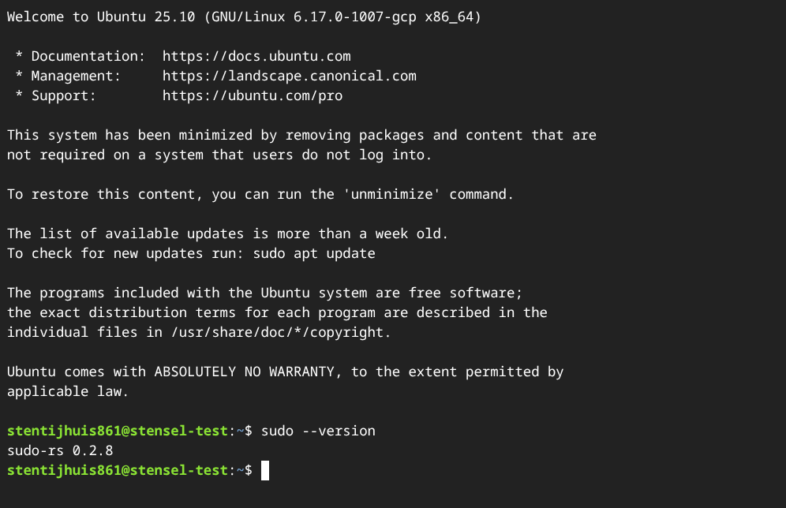
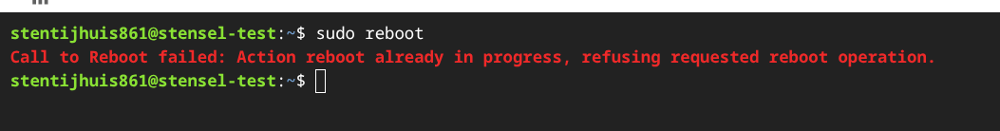
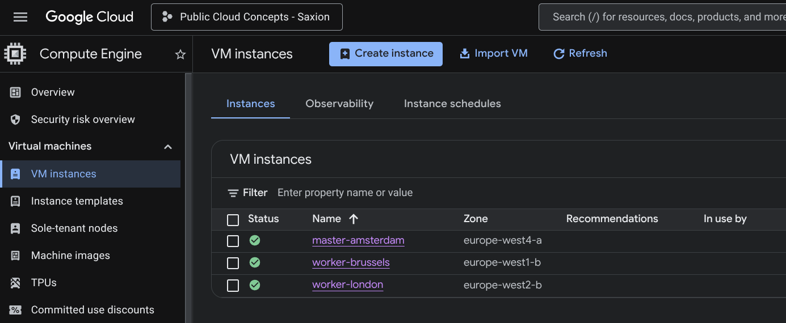
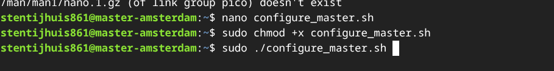
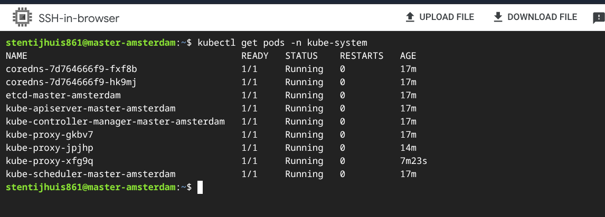
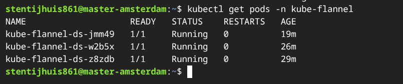

| [Overzicht](../../README.md) | [Week 2 - Kubernetes Networking & CI/CD](../../Week%202/README.md) |
|:---|---:|

---

# Mijn Uitwerking - Week 1

## 1.1 Google Cloud & GKE - Voltooide Badges

Voltooide badges via [Google Cloud Skills Boost](https://www.skills.google/public_profiles/d92d9d25-7174-4f3a-8f70-fab880429afe):

<a href="https://www.skills.google/public_profiles/d92d9d25-7174-4f3a-8f70-fab880429afe"></a>
<a href="https://www.skills.google/public_profiles/d92d9d25-7174-4f3a-8f70-fab880429afe"></a>
<a href="https://www.skills.google/public_profiles/d92d9d25-7174-4f3a-8f70-fab880429afe"></a>

---

## 1.2 Kubernetes Uitdaging

### Opdracht 1 - Cluster Installatie

> **Opmerking:** De opdracht specificeert Ubuntu 24.04 LTS minimal. Ik heb **Ubuntu 25.10 LTS minimal** gebruikt.
>
> Ubuntu 25.10 komt standaard met `sudo-rs` (een Rust-herimplementatie van sudo) versie 0.2.8, zoals hieronder te zien is:
>
> 
>
> Deze versie heeft een bekende sessiebug. `sudo reboot` mislukt bijvoorbeeld met een onverwachte fout in plaats van te herstarten:
>
> 
>
> Opgelost via een GCP-opstartscript ([AUTOSTART-configure_classic_sudo.sh](../Bestanden/AUTOSTART-configure_classic_sudo.sh)) dat klassieke `sudo` installeert bij elke opstart ter vervanging van `sudo-rs`:
>
> 

**Gebruikte instanties:**

| Node | Naam | Zone | Type | OS |
|------|------|------|------|----|
| Master | master-amsterdam | europe-west4-a (Nederland) | e2-medium | Ubuntu 25.10 LTS minimal |
| Worker 1 | worker-brussels | europe-west1-b (Belgie) | e2-medium | Ubuntu 25.10 LTS minimal |
| Worker 2 | worker-london | europe-west2-b (Verenigd Koninkrijk) | e2-medium | Ubuntu 25.10 LTS minimal |




Het cluster heb ik geinstalleerd met twee eigen shell-scripts: [`configure_master.sh`](../Bestanden/configure_master.sh) voor de masternode en [`configure_worker.sh`](../Bestanden/configure_worker.sh) voor de workernodes. Deze scripts automatiseren alle stappen: kernelmoduleconfiguratie, containerd installeren, Kubernetes-pakketinstallatie (v1.35) en clusterinitialisatie.




Nadat beide workers klaar waren, heb ik ze via het `kubeadm join`-commando van de master aan het cluster toegevoegd. De screenshot hieronder toont de volledige Flannel-installatie, de twee workers die toetreden en de uiteindelijke `kubectl get nodes` waaruit blijkt dat alle drie nodes `Ready` zijn:


**Uitleg van `kubeadm init`:**

`kubeadm init` zet het Kubernetes-besturingsvlak op op de masternode. Het genereert alle TLS-certificaten (voor de API-server, etcd en kubelet), schrijft kubeconfig-bestanden, maakt de statische Pod-manifesten aan voor de kerncomponenten (kube-apiserver, kube-controller-manager, kube-scheduler, etcd) en genereert een bootstrap-token waarmee workernodes het cluster kunnen binnenkomen. Het wordt alleen op de master uitgevoerd omdat de master de enige node is die het besturingsvlak draait. Workernodes draaien geen API-server of etcd, die voeren alleen workloads uit via kubelet.

**Uitleg van `kubectl apply -f kube-flannel.yml`:**

Dit commando installeert Flannel als de Container Network Interface (CNI) plugin. Kubernetes regelt zelf geen pod-naar-pod networking, dat wordt gedelegeerd aan een CNI-plugin. Flannel maakt een overlay-netwerk (standaard VXLAN) dat elk pod een uniek IP-adres geeft, zodat pods op verschillende nodes direct met elkaar kunnen communiceren, zelfs over regio's heen. Het `apply -f`-commando leest het Flannel-manifest en maakt alle benodigde resources aan: een DaemonSet (zodat Flannel op elke node draait), een ConfigMap met de netwerkconfiguratie (CIDR `10.244.0.0/16`) en de benodigde RBAC-regels. De CIDR moet overeenkomen met de `--pod-network-cidr` die je aan `kubeadm init` hebt meegegeven.

**Andere netwerk-CNIs:**

| CNI | Beschrijving |
|-----|-------------|
| **Flannel** | Eenvoudig L3 overlay-netwerk via VXLAN. Makkelijk op te zetten, geen netwerkbeleidsondersteuning. |
| **Calico** | Veelzijdige CNI met BGP-routing en volledige NetworkPolicy-ondersteuning. Veel gebruikt in productie. |
| **Cilium** | eBPF-gebaseerde CNI met geavanceerde observeerbaarheid en beveiliging. |
| **Weave Net** | Mesh overlay-netwerk, eenvoudige installatie, ondersteunt NetworkPolicy. |
| **Canal** | Combineert Flannel (networking) met Calico (netwerkbeleid). |

**1a - Uitvoer van `kubectl get nodes`:**

```
NAME               STATUS   ROLES           AGE    VERSION
worker-brussels    Ready    <none>          14m    v1.35.1
worker-london      Ready    <none>          7m     v1.35.1
master-amsterdam   Ready    control-plane   17m    v1.35.1
```

**Uitvoer van `kubectl get pods -n kube-system`:**



```
NAME                                          READY   STATUS    RESTARTS   AGE
coredns-7d764666f9-fxf8b                      1/1     Running   0          17m
coredns-7d764666f9-hk9mj                      1/1     Running   0          17m
etcd-master-amsterdam                         1/1     Running   0          17m
kube-apiserver-master-amsterdam               1/1     Running   0          17m
kube-controller-manager-master-amsterdam      1/1     Running   0          17m
kube-proxy-gkbv7                              1/1     Running   0          17m
kube-proxy-jpjhp                              1/1     Running   0          14m
kube-proxy-xfg9q                              1/1     Running   0          7m23s
kube-scheduler-master-amsterdam               1/1     Running   0          17m
```

> **Opmerking:** De `kube-flannel`-pods staan hier niet bij omdat Flannel zijn eigen `kube-flannel`-namespace aanmaakt. Geverifieerd met `kubectl get pods -n kube-flannel`:



```
NAME                    READY   STATUS    RESTARTS   AGE
kube-flannel-ds-jmm49   1/1     Running   0          19m
kube-flannel-ds-w2b5x   1/1     Running   0          26m
kube-flannel-ds-z8zdb   1/1     Running   0          29m
```

Er draait één `kube-flannel-ds`-pod op elke node (master + 2 workers) als een DaemonSet. Elke pod configureert het VXLAN overlay-netwerk op zijn node, zodat pods op verschillende nodes en regio's elkaar kunnen bereiken.

**Verklaring van de kube-system pods:**

De `kube-system`-namespace bevat de kerncomponenten van Kubernetes:

| Pod | Rol |
|-----|-----|
| `kube-apiserver` | Het front-end van het besturingsvlak. Alle kubectl-commando's, node-registraties en interne componenten lopen via deze REST API. Draait alleen op de master. |
| `kube-controller-manager` | Voert alle controller-loops uit: zorgt dat het juiste aantal pod-replica's draait, beheert node-levenscycli, handelt certificaatrotatie af, enz. Alleen op master. |
| `kube-scheduler` | Bewaakt niet-ingeplande pods en wijst ze toe aan een geschikte node op basis van beschikbare resources, taints en affinity-regels. Alleen op master. |
| `etcd` | Gedistribueerde sleutel-waardeopslag met de volledige clusterstatus. Alle API-server lees- en schrijfacties gaan via etcd. Alleen op master. |
| `kube-proxy` | Draait op elke node. Beheert iptables/nftables-regels zodat Service-IPs verkeer correct naar pods routeren. Een pod per node, dus drie in totaal voor master + 2 workers. |
| `coredns` | Cluster-interne DNS. Pods lossen servicenamen op (bijv. `my-service.default.svc.cluster.local`) via CoreDNS. Twee replica's voor redundantie. |

---

### Opdracht 2 - Gecontaineriseerde Applicatie

**Uitleg Dockerfile:**

```dockerfile
FROM nginx:alpine
COPY static-site/ /usr/share/nginx/html/
EXPOSE 80
CMD ["nginx", "-g", "daemon off;"]
```

**`FROM nginx:alpine`**: Het image is gebouwd op basis van het officiele `nginx:alpine` base image. De `alpine`-variant is bewust gekozen boven `nginx:latest` (Debian-gebaseerd): Alpine Linux is veel kleiner (~5 MB vs ~180 MB), heeft veel minder voorgeinstalleerde software en heeft daarmee een kleiner aanvalsoppervlak met minder CVEs. Voor een simpele statische webserver is het volledige Debian-image gewoon onnodige overhead.

**`COPY static-site/ /usr/share/nginx/html/`**: Dit kopieert de volledige `static-site/`-map (met `index.html` en eventuele assets) naar de nginx-documentroot. Wanneer een browser een verzoek stuurt, serveert nginx dit bestand als HTTP-respons. Zo wordt de eigen website in het image geladen en vervangt het de standaard placeholder van nginx.

**`EXPOSE 80`**: Geeft aan dat de container luistert op poort 80 (standaard HTTP). Dit is een conventie voor Docker en Kubernetes om te weten welke poort de applicatie gebruikt, en is nodig voor het routeren van verkeer. Zonder dit kunnen browsers geen verbinding maken via de standaard HTTP-poort. Bij een niet-standaard poort (bijv. 8000) moeten clients dit expliciet aangeven, bijv. `stentijhuis.nl:8000`.

**`CMD ["nginx", "-g", "daemon off;"]`**: Dit is het opstartcommando van de container. Het start nginx op de voorgrond (`daemon off` voorkomt dat nginx naar de achtergrond forkt). Containers draaien rond een enkel voorgrondproces: als dat stopt, stopt de container. Nginx op de voorgrond houden zorgt dat de container actief blijft zolang nginx draait.

**GitHub Actions workflow:**

De workflow staat in [`.github/workflows/ci_week1.yml`](../../.github/workflows/ci_week1.yml) en draait automatisch bij elke push of pull request naar `main`. De relevante stappen voor de opdracht:

- **Build:** het Docker image wordt gebouwd vanuit `Week 1/Bestanden/Dockerfile`
- **Login:** inloggen bij DockerHub via repository-secrets (`DOCKER_USERNAME` en `DOCKER_PAT`), alleen bij een directe push naar `main`
- **Push:** het image wordt gepusht als `stensel8/public-cloud-concepts:latest`, ook alleen bij directe pushes naar `main` (niet bij PRs)

De secrets stel je in via **Settings > Secrets and Variables > Actions > Repository Secrets** in de GitHub-repository.

**2a - Uitleg van de deployment.yaml structuur:**

Het voltooide `deployment.yml` dat ik voor deze opdracht heb gebruikt:

```yaml
apiVersion: apps/v1
kind: Deployment
metadata:
  name: first-deployment
spec:
  replicas: 2
  selector:
    matchLabels:
      app: my-container
  template:
    metadata:
      labels:
        app: my-container
    spec:
      containers:
      - name: my-container
        image: stensel8/public-cloud-concepts:latest
        ports:
        - containerPort: 80
```

**`apiVersion: apps/v1`**: Geeft aan welke Kubernetes API-groep en versie gebruikt wordt. `apps/v1` is de stabiele API voor workload-resources zoals Deployments, ReplicaSets en StatefulSets.

**`kind: Deployment`**: Bepaalt het type resource. Een Deployment beheert een ReplicaSet, die ervoor zorgt dat het gewenste aantal pod-replica's altijd draait. Als een pod crasht of wordt verwijderd, maakt de Deployment-controller automatisch een nieuwe aan.

**`metadata.name: first-deployment`**: Een unieke naam voor deze Deployment binnen de namespace, waarmee je het kunt identificeren en beheren via `kubectl`.

**`spec.replicas: 2`**: Vertelt Kubernetes om altijd precies 2 actieve pods van deze applicatie te onderhouden.

**`spec.selector.matchLabels`**: Vertelt de Deployment welke pods bij hem horen. Hij selecteert pods met het label `app: my-container`. Dit label moet overeenkomen met de labels in het pod-sjabloon hieronder.

**`spec.template`**: Het pod-sjabloon. Alles onder deze sleutel bepaalt hoe elke nieuwe pod eruitziet.

- **`metadata.labels: app: my-container`**: Het label dat op elke pod wordt gezet. Moet overeenkomen met `spec.selector.matchLabels` zodat de Deployment zijn pods kan bijhouden.
- **`spec.containers[0].name: my-container`**: De naam van de container in de pod.
- **`spec.containers[0].image: stensel8/public-cloud-concepts:latest`**: Het Docker image dat van DockerHub gepullt en uitgevoerd wordt. Dit is het image dat door de GitHub Actions workflow gebouwd en gepusht is.
- **`spec.containers[0].ports[0].containerPort: 80`**: Geeft aan dat de container op poort 80 (HTTP) luistert. Dit is informatief voor Kubernetes en nodig zodat Services verkeer naar de juiste poort kunnen sturen.

De deployment heb ik toegepast met:

```bash
kubectl apply -f deployment.yml
```

**2b - Pod-IPs en `curl`-uitvoer:**

Na het toepassen van de deployment kwamen beide pods op `Running` in twee verschillende regio's, wat aantoont dat Flannel pod-verkeer correct routeert over GCP-regio's heen:


```text
NAME                               READY   STATUS    RESTARTS   AGE   IP           NODE              NOMINATED NODE   READINESS GATES
first-deployment-5ffbd9444c-5hkzs  1/1     Running   0          88s   10.244.2.2   worker-london     <none>           <none>
first-deployment-5ffbd9444c-s4xdb  1/1     Running   0          88s   10.244.1.2   worker-brussels   <none>           <none>
```

`curl` uitgevoerd van de masternode naar de pod op `worker-london` (`10.244.2.2`):


```html
<!doctype html>
<html lang="en">
<head>
  <meta charset="utf-8">
  <meta content="width=device-width, initial-scale=1.0" name="viewport">
  <title>Sten Tijhuis - Public Cloud Concepts</title>
  <!-- Bootstrap CSS, Google Fonts, iconen ... (afgekapt) -->
```

De respons bevestigt dat de nginx-container draait en de statische site serveert via het interne Flannel-IP. Dit IP is alleen bereikbaar vanuit het cluster, niet via een browser van buitenaf. Externe toegang vereist een Kubernetes Service (behandeld in Week 2).

**2c - Uitvoer van `kubectl exec -it <pod> -- cat /usr/share/nginx/html/index.html`:**

Inloggen op de pod via `kubectl exec` en het bestand direct uitlezen bevestigt dat de `index.html` correct door de Dockerfile in de nginx-documentroot is geplaatst:

```html
<!doctype html>
<html lang="en">
<head>
  <meta charset="utf-8">
  <meta content="width=device-width, initial-scale=1.0" name="viewport">
  <title>Sten Tijhuis - Public Cloud Concepts</title>
  <!-- Bootstrap CSS, Google Fonts, iconen ... (afgekapt) -->
```

---

| [Overzicht](../../README.md) | [Week 2 - Kubernetes Networking \& CI/CD](../../Week%202/README.md) |
|:---|---:|
