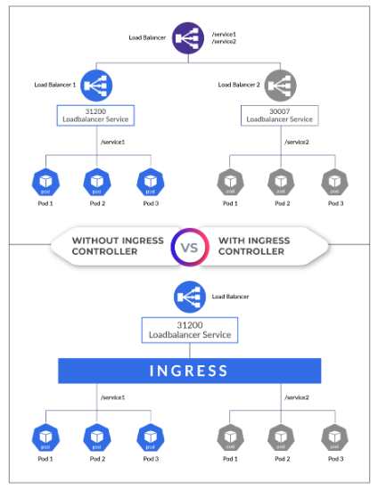

# Assignments Week 2

## 2.1 Google Kubernetes Engine (GKE) and DORA

This week you will extend your knowledge of GKE and analyse about DORA.

- Complete the Kubernetes Engine: Qwik Start (GSP100, 1 credit): <https://www.cloudskillsboost.google/focuses/878?parent=catalog> and submit proof by connecting to the container using `kubectl exec` and show the last 15 lines of the webserver logfile.
- Complete the lab "Managing Deployments Using Kubernetes Engine" (5 credits) of the course "Set Up and Configure a Cloud Environment in Google Cloud". You can find this course at: <https://www.cloudskillsboost.google/paths/11/course_templates/625>
  Submit proof using screenshots.
- Analyse how all DORA's technical capabilities could yield better Organizational Performance (processes) and Well-being (people).

## 2.2 Kubernetes Challenge (part 2)

In week 1, a pod was started in which a container is running (web server). However, the pod can only be accessed via the IP of the pod. This is vulnerable because if the pod fails (or is thrown away) a new one is created (provided the deployment is active) and it has a different IP address.

1. Make sure last week's deployment is up and running. Check which pods are active and what their IP address is.
2. Delete a pod (`kubectl delete pod`) while the deployment remains active. Check that a new one is created. Also check whether the IP has been adjusted.
3. In order to be able to access the pods via a fixed IP, the various options are tested.

   Create a file `service.yaml` that creates a service for the previously created pods. First, choose `ClusterIP` as the type.

   Create the service and then request the IP address using `kubectl get service`.

4. It should now be possible to reach the web server in the pods from any node in the cluster (including the master) via the ClusterIP. Test this on each node by means of:

   ```bash
   curl <clusterip>
   ```

5. Now adapt the service to `NodePort`. A port will now open on each node (including the master) through which the pods can be reached.

   Test this first by using the command `curl <internal-ip-node>:<open-port>`. This should work on every node. Then, test it by choosing the external IP of the nodes. That doesn't work yet because the firewall blocks it.

   Adjust the firewall for VPC-Network. Open the port in question for all instances on the network. Now test again if it works.

   Test from your PC in a browser if you can reach the application. This should work.

6. Now adjust the service to type `LoadBalancer`. Check the service with `kubectl get service`. You will now see that the service does not yet have an external IP (pending). Explain why.

7. In order to be able to see the load balancer functionality, we now switch to the Google Cloud and use the GKE (Google Kubernetes Engine) service. Create a Kubernetes Cluster there and make sure that the same deployment and service are created as in google instances (so the container with a web server must be running). Adjust the service to type `LoadBalancer` and check if an external IP address is now created. Test if the service is accessible via the internet in a browser on your PC (it should be).

   

8. There is now a load balancer for an application so that it can be reached from the internet. If there are multiple applications, that would mean that there would have to be multiple load balancers (1 per service). We now want to unlock multiple services via 1 so-called Ingress.

   First, create two containers like the one you created now. For example, one simulates the website bison and the other the website brightspace (for example, only a welcome message is shown). Then make sure that there is a deployment and service for each of these 2 so that they are accessible. The service type is e.g. `NodePort` or `ClusterIP`. Create an Ingress now so that the "bison" website is accessible via `bison.mysaxion.nl` and the "brightspace" website via `brightspace.mysaxion.nl`.

   Also create a hosts file in which you resolve both names to the IP address of the ingress controller.

   Also investigate the load balancer that is automatically created and the Ingress in Google's portal (see e.g. the monitoring).
