[🇳🇱 Nederlands](README.md) | 🇬🇧 English

---

> [!NOTE]
> This repository is maintained primarily in **Dutch**. This English version may be incomplete or outdated. An English translation may be added in the future, but is not guaranteed.

---

| [← Week 1 - Introduction & Deployments](../Week%201/README.en.md) | [Week 3 →](../Week%203/) |
|:---|---:|

---

# Week 2 - Kubernetes Networking & CI/CD

## Topics

This week you will learn about **Kubernetes Networking**. You create a Kubernetes Cluster in Google Cloud and learn about the **LoadBalancer** Service type.

---

## Learning Goals

- [ ] Analyze the Software Development Life Cycle (SDLC)
- [ ] Explore DevOps strategies for automation
- [ ] Connecting a source code repository and building applications from Artifact Repositories
- [ ] Setting up CI/CD for a DTAP environment
- [ ] How to use Kubernetes in the Cloud (GKE)
- [ ] Using Cloud Shell and `kubectl` to interact with Kubernetes clusters
- [ ] Knowing networking in Kubernetes

---

## Learning Materials

### DevOps & CI/CD

| Resource | Link |
|---|---|
| AWS Whitepaper - Practicing Continuous Integration and Continuous Delivery on AWS | [docs.aws.amazon.com (PDF)](https://docs.aws.amazon.com/whitepapers/latest/practicing-continuous-integration-continuous-delivery/welcome.html) |
| 2023 Accelerate State of DevOps Report | [cloud.google.com](https://cloud.google.com/blog/products/devops-sre/announcing-the-2023-state-of-devops-report) |
| DORA's Research Program | [dora.dev](https://dora.dev/research/) |

### Kubernetes & GKE

| Resource | Link |
|---|---|
| Google Kubernetes Engine documentation | [cloud.google.com](https://cloud.google.com/kubernetes-engine/docs/#training-and-tutorials) |
| Getting Started with Kubernetes Engine | [github.com/GoogleCloudPlatform](https://github.com/GoogleCloudPlatform/qwiklabs-training-content/blob/master/labs/GCPFUND-Kubernetes/instructions/en.md) |
| Kubernetes Engine - Qwik Start (GSP100) | [cloudskillsboost.google](https://www.cloudskillsboost.google/catalog_lab/911?qlcampaign=77-18-gcpd-236&utm_source=gcp&utm_medium=documentation&utm_campaign=kubernetes) |

---

## Course Documents

| Document | Description |
|---|---|
| [Slides week 2 - Kubernetes Networking](Les%202%20Kubernetes%20networking%20ENG.pdf) | Theory about Kubernetes networking |
| [Assignments week 2 v2](PCC/Assignments%20week%202%20v2.docx) | Assignments for week 2 |

---

## Files in This Directory

| File / Folder | Description |
|---|---|
| [ingress.yml](ingress.yml) | Kubernetes Ingress manifest for routing external traffic |
| [bison/](bison/) | Deployment and service manifests for the Bison application |
| [brightspace/](brightspace/) | Deployment and service manifests for the Brightspace application |
| [PCC/](PCC/) | Additional project files and assignments |

---

# My Work

## CI/CD - Docker Hub Tags

The GitHub Actions workflow ([ci_week2.yml](../.github/workflows/ci_week2.yml)) builds and pushes two images to the existing `stensel8/public-cloud-concepts` DockerHub repository using separate tags:

| Image | Tag | Pull command |
|-------|-----|--------------|
| Bison app | `bison` | `docker pull stensel8/public-cloud-concepts:bison` |
| Brightspace app | `brightspace` | `docker pull stensel8/public-cloud-concepts:brightspace` |

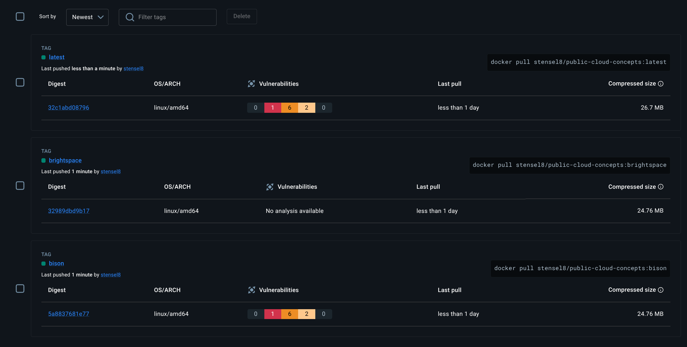

---

## 2.2 Kubernetes Challenge (part 2)

### Assignment 2.2a - Deployment up and running

The Week 1 deployment (`first-deployment`) is confirmed running on the kubeadm cluster with both pods active across two regions:

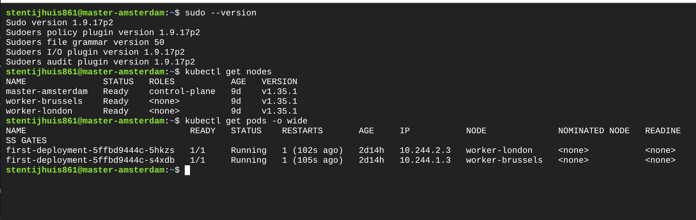

```
NAME               STATUS   ROLES           AGE   VERSION
master-amsterdam   Ready    control-plane   9d    v1.35.1
worker-brussels    Ready    <none>          9d    v1.35.1
worker-london      Ready    <none>          9d    v1.35.1

NAME                                READY   STATUS    RESTARTS      IP           NODE
first-deployment-5ffbd9444c-5hkzs   1/1     Running   1 (102s ago)  10.244.2.3   worker-london
first-deployment-5ffbd9444c-s4xdb   1/1     Running   1 (105s ago)  10.244.1.3   worker-brussels
```

---

### Assignment 2.2b - Pod deletion and recreation

A pod was deleted while the Deployment remained active. Kubernetes automatically created a replacement pod with a **different IP address**, demonstrating that pod IPs are ephemeral and not stable identifiers.

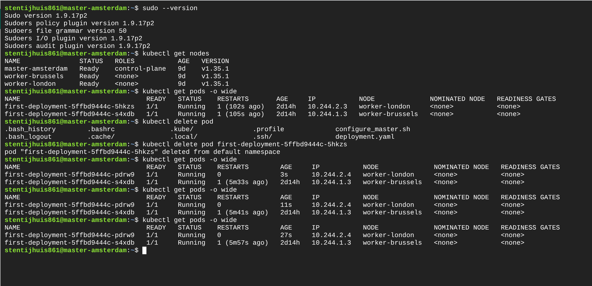

```
# Before delete:
first-deployment-5ffbd9444c-5hkzs   IP: 10.244.2.3   worker-london

# After delete - new pod:
first-deployment-5ffbd9444c-pdrw0   IP: 10.244.2.4   worker-london
```

The IP changed from `10.244.2.3` to `10.244.2.4`. This is exactly why a Service is needed: pods are disposable and their IPs change. A Service provides a stable virtual IP that always routes to the healthy pods behind it, regardless of pod restarts.

---

### Assignment 2.2c - ClusterIP Service

A Service of type `ClusterIP` was created for the deployment:

```yaml
apiVersion: v1
kind: Service
metadata:
  name: first-service
spec:
  type: ClusterIP
  selector:
    app: my-container
  ports:
    - port: 80
      targetPort: 80
```

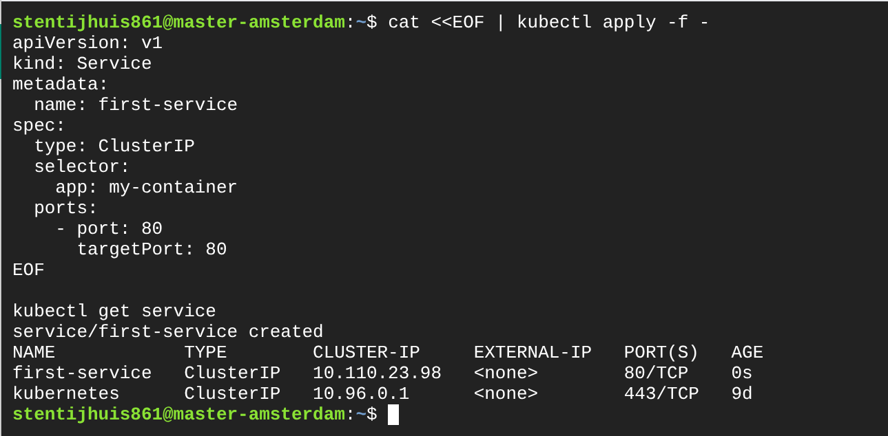

```
NAME            TYPE        CLUSTER-IP      EXTERNAL-IP   PORT(S)   AGE
first-service   ClusterIP   10.110.23.98    <none>        80/TCP    0s
```

The ClusterIP `10.110.23.98` is a stable virtual IP managed by `kube-proxy`. It is only reachable from within the cluster, not from outside. Traffic sent to this IP is load-balanced across all pods matching the selector `app: my-container`.

---

### Assignment 2.2d - ClusterIP reachable from every node

The ClusterIP was tested from all three nodes in the cluster. All nodes returned the HTML response, confirming that `kube-proxy` correctly routes traffic to the pods regardless of which node sends the request.

**From master-amsterdam (`10.164.0.14`):**

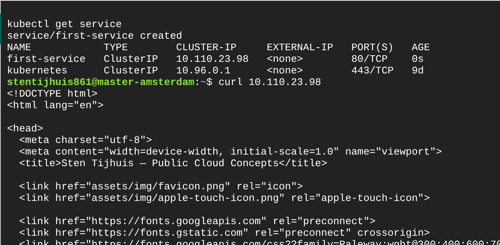

**From worker-brussels (`10.132.0.5`):**

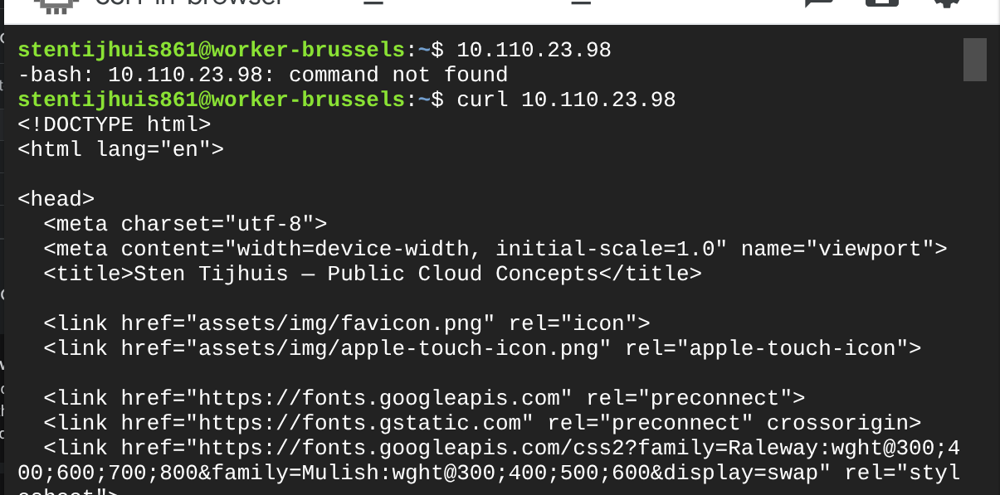

**From worker-london (`10.154.0.5`):**

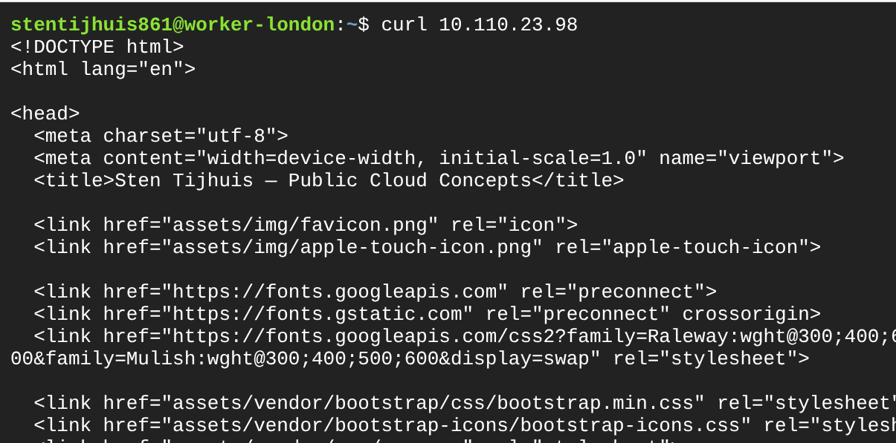

All three nodes reached the application via `curl 10.110.23.98`, proving the ClusterIP is accessible cluster-wide.

---

### Assignment 2.2e - NodePort Service

The service was updated to type `NodePort`:

```yaml
apiVersion: v1
kind: Service
metadata:
  name: first-service
spec:
  type: NodePort
  selector:
    app: my-container
  ports:
    - port: 80
      targetPort: 80
      nodePort: 32490
```

With `type: NodePort`, Kubernetes automatically opens a port (here `32490`) on **every node** in the cluster. Traffic arriving on that port on any node is forwarded to the pods via `kube-proxy`. Kubernetes assigned port `32490`:

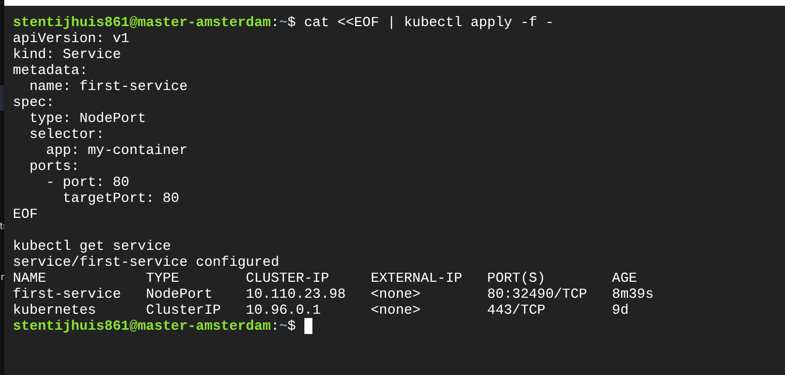

```
NAME            TYPE       CLUSTER-IP      EXTERNAL-IP   PORT(S)        AGE
first-service   NodePort   10.110.23.98    <none>        80:32490/TCP   8m39s
```

**Node internal IPs:**

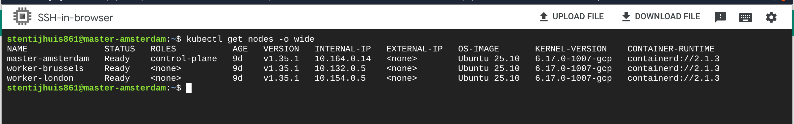

| Node | Internal IP |
|------|-------------|
| master-amsterdam | 10.164.0.14 |
| worker-brussels | 10.132.0.5 |
| worker-london | 10.154.0.5 |

**Local access via `kubectl port-forward`:**

For testing without opening firewall rules, `kubectl port-forward` can be used. This creates a temporary tunnel from `localhost` to the service, only on the machine where the command runs:

```bash
kubectl port-forward service/first-service 8080:80
```

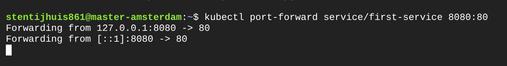

From a second terminal on the same machine, the service is reachable via `curl localhost:8080`:

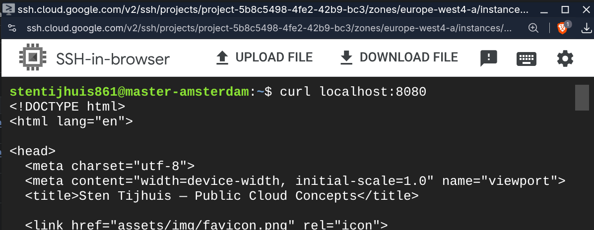

> [!NOTE]
> `kubectl port-forward` is a **developer tool for local testing**, not an external access solution. The tunnel is only reachable on the machine where the command runs (`127.0.0.1`) and stops as soon as you press `Ctrl+C`. For external browser access from outside the cluster, this is not usable without additional SSH tunneling.

**External access via NodePort + firewall rule:**

NodePort opens the port on every node, but GCP blocks inbound traffic by default via the VPC firewall. Attempting to reach the application via the external IP (`34.140.10.158`) on port `32490` from a browser failed:

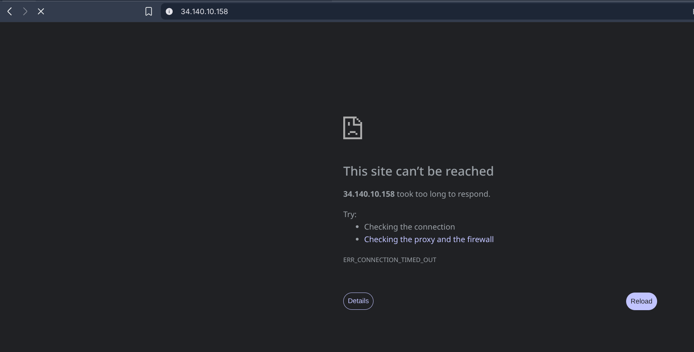

A firewall rule was created in **VPC Network -> Firewall** to allow inbound TCP traffic on port `32490`:

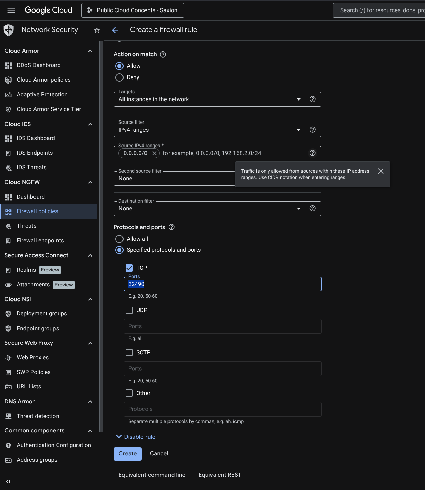

After applying the rule, the application is reachable from a browser via `http://34.160.10.158:32490`:

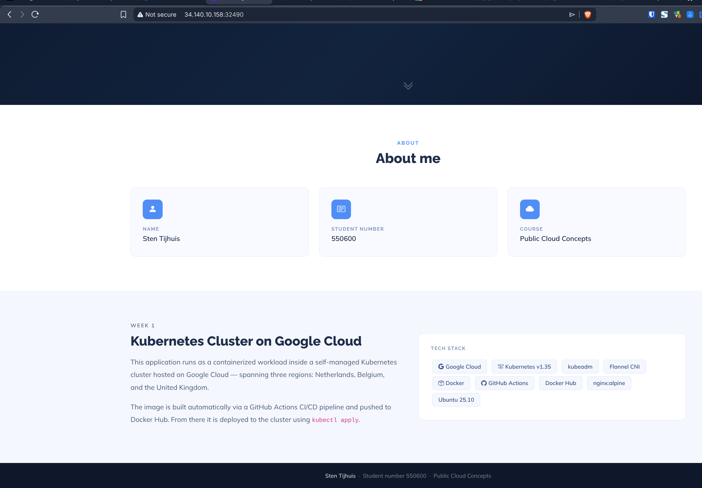

This confirms the full NodePort flow: external traffic -> node external IP -> port 32490 -> `kube-proxy` -> ClusterIP -> pods.

> [!NOTE]
> The firewall rule is the **expected approach** for NodePort on a bare-VM cluster; it is not a hack, it is simply how GCP networking works. The real limitation is NodePort itself: on a production system you do not want to manually manage firewall rules per service. The intended solution is a `LoadBalancer` service on a managed cluster (GKE), which handles this automatically (see assignment 2.2g).

---

### Assignment 2.2f - LoadBalancer on the kubeadm cluster

The service was updated to type `LoadBalancer`:

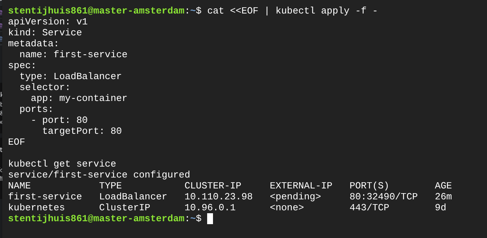

```
NAME            TYPE           CLUSTER-IP     EXTERNAL-IP   PORT(S)        AGE
first-service   LoadBalancer   10.110.23.98   <pending>     80:32490/TCP   26m
```

The `EXTERNAL-IP` column stays at `<pending>` indefinitely, regardless of how many times `kubectl get service` is run:

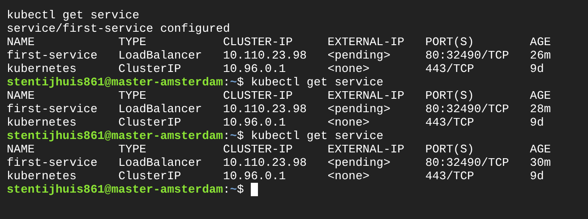

**Why does it stay pending?**

A `LoadBalancer` service works by asking the **cloud controller manager** to provision an external load balancer on the underlying cloud platform and assign it a public IP. On a self-managed kubeadm cluster running on plain GCP VMs, there is no cloud controller manager. Kubernetes has no knowledge of or integration with the GCP API. There is no component that can request a load balancer on Kubernetes' behalf, so the external IP is never assigned and the service remains `<pending>` forever.

This is the fundamental difference with managed Kubernetes services like **GKE**: GKE includes the GCP cloud controller manager, which automatically provisions a Google Cloud Load Balancer and assigns a real external IP whenever a `LoadBalancer` service is created.

#### Why is pending normal behavior on our setup?

Our kubeadm cluster runs on plain GCP VMs with Kubernetes set up manually. Kubernetes itself has no knowledge of GCP: there is no cloud controller manager present that can call the GCP API. The pending behavior is therefore **completely expected and correct**: Kubernetes is waiting for a signal that will never arrive. This is not an error, but a logical consequence of the setup.

#### Summary: What are the options?

| Approach | How | When |
|---|---|---|
| **Correct way** | Use a managed cluster (GKE): the cloud controller manager automatically provisions a Load Balancer with an external IP | Production, assignments 2.2g and beyond |
| **NodePort + firewall rule** | Manually open a GCP firewall rule for the NodePort port | Workaround on kubeadm, for demo/testing only |
| **Ingress controller** | Install an nginx Ingress controller (itself a LoadBalancer service on GKE) that routes multiple services through a single external IP | Multiple apps behind one load balancer (assignment 2.2h) |

> [!IMPORTANT]
> Using **NodePort as an external access method** was the workaround, not the firewall rule itself. For NodePort on GCP, a firewall rule is simply required. The instructor pointed out that the intended approach is to use GKE (assignment 2.2g): the cloud controller manager there automatically provisions a load balancer, without having to manually manage firewall rules.

---

### Assignment 2.2g - LoadBalancer on GKE (real external IP)

#### Creating the GKE cluster

A new GKE cluster `week2-cluster` was created via the GCP Console (Kubernetes Engine -> Create cluster).

**Cluster basics** - name `week2-cluster`, zone `europe-west4-a`, Standard mode, Regular release channel:

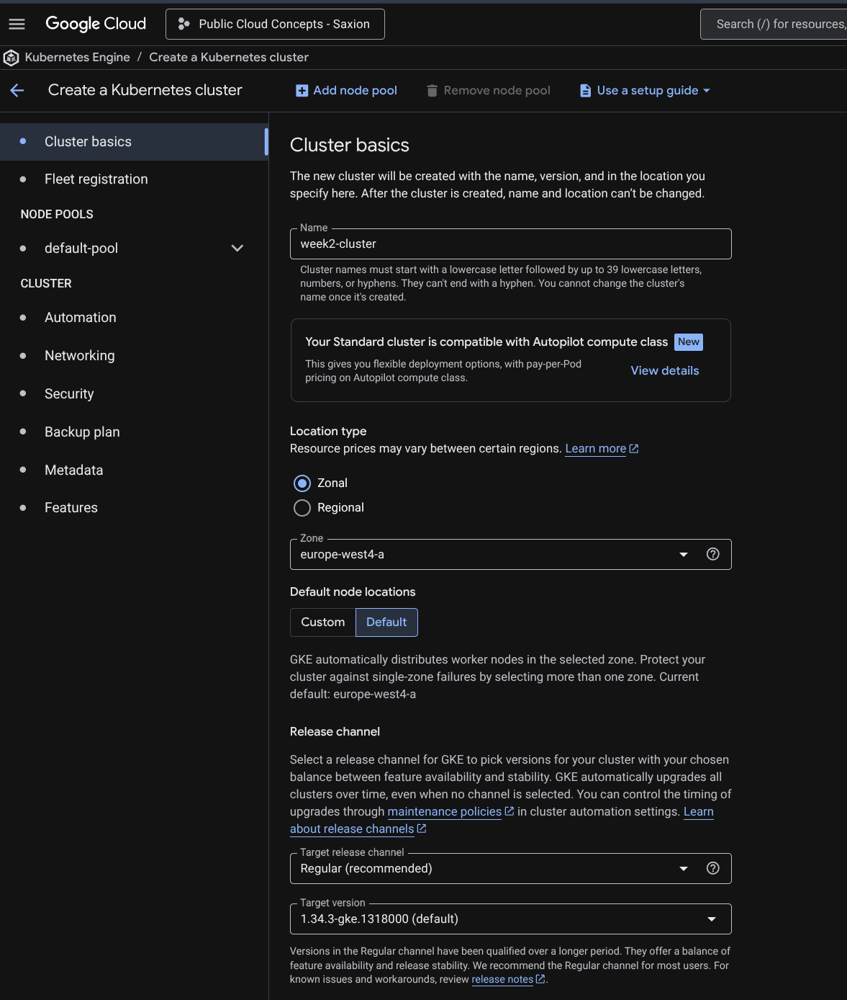

**Node pool - machine type** - `e2-medium` (2 vCPU, 4 GB memory), Standard persistent disk, 100 GB boot disk:

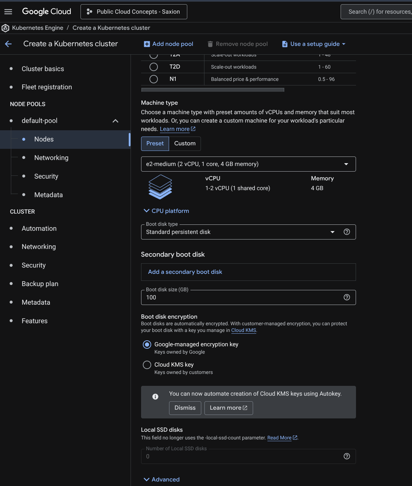

**Node pool - details** - pool name `default-pool`, 2 nodes, control plane version `1.34.3-gke.1318000`, zone `europe-west4-a`:

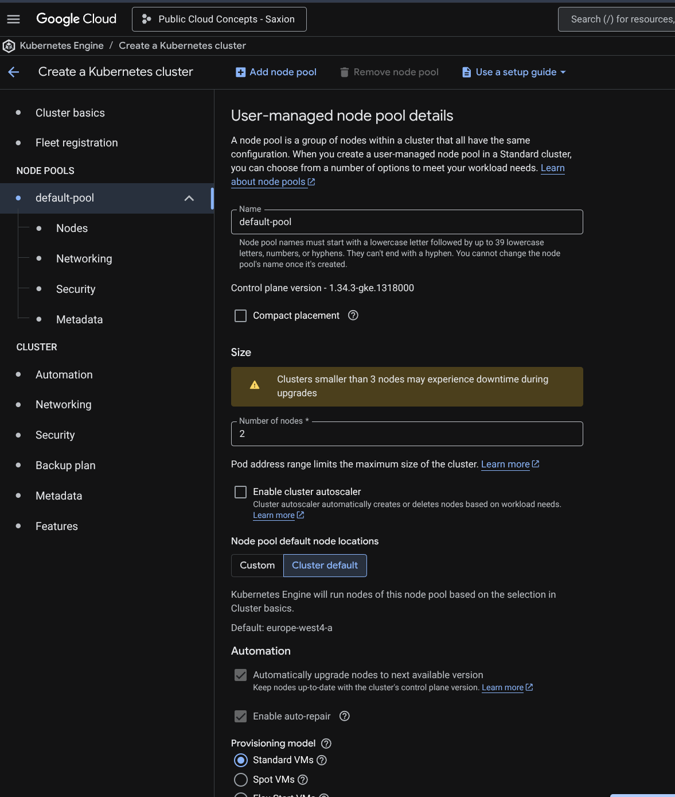

After clicking Create, the cluster entered the provisioning phase:

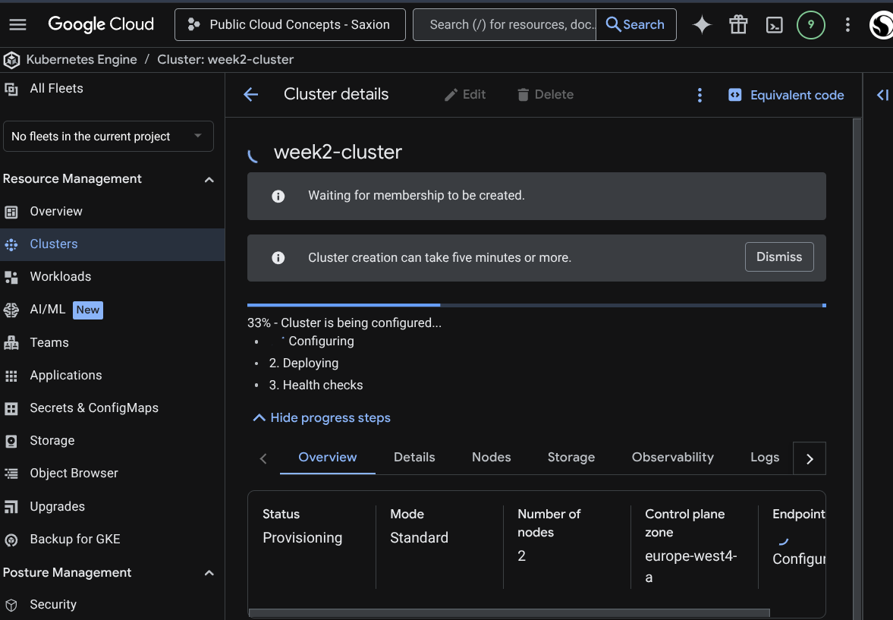

```
Status: Provisioning   Mode: Standard   Nodes: 2   Zone: europe-west4-a
```

---

#### Setting up kubectl for GKE (CachyOS / Arch Linux)

Before deploying to GKE, the local `kubectl` must be connected to the GKE cluster. The `gcloud` CLI was not yet installed, so the following steps were taken:

**1. Install gcloud CLI via AUR:**
```bash
paru -S google-cloud-cli
paru -S google-cloud-cli-component-gke-gcloud-auth-plugin
```

**2. Authenticate with Google:**
```bash
gcloud auth login
```

**3. Set the project:**
```bash
gcloud config set project project-5b8c5498-4fe2-42b9-bc3
```

**4. Fetch cluster credentials:**
```bash
gcloud container clusters get-credentials week2-cluster --zone europe-west4-a
```

**5. Verify kubectl is connected:**
```bash
kubectl get nodes
```

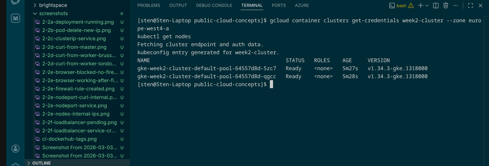

```
NAME                                           STATUS   ROLES    AGE    VERSION
gke-week2-cluster-default-pool-64557d8d-5zc7   Ready    <none>   5m     v1.34.3-gke.1318000
gke-week2-cluster-default-pool-64557d8d-qgcc   Ready    <none>   5m1s   v1.34.3-gke.1318000
```

Both GKE nodes are `Ready`. Unlike the self-managed kubeadm cluster, GKE includes the Google Cloud controller manager, which means a `LoadBalancer` service will receive a real external IP automatically.

#### Deploying to GKE

The Week 1 deployment and LoadBalancer service were applied to the GKE cluster:

```bash
kubectl apply -f "Week 1/deployment.yml"
kubectl apply -f "Week 1/service.yml"
```

Then the external IP was watched with repeated `kubectl get service first-service` calls:

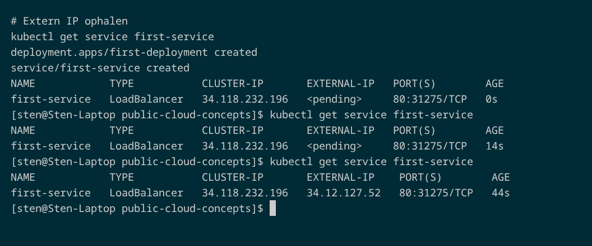

```
NAME            TYPE           CLUSTER-IP       EXTERNAL-IP     PORT(S)        AGE
first-service   LoadBalancer   34.118.232.196   <pending>       80:31275/TCP   0s
first-service   LoadBalancer   34.118.232.196   <pending>       80:31275/TCP   14s
first-service   LoadBalancer   34.118.232.196   34.12.127.52    80:31275/TCP   44s
```

Within ~44 seconds, GKE provisioned a **Google Cloud Load Balancer** and assigned the real external IP `34.12.127.52`. This is the key difference with the self-managed kubeadm cluster where the external IP remained `<pending>` forever. GKE's cloud controller manager handles the provisioning automatically.

**Browser test:**

Navigating to `http://34.12.127.52` in the browser confirms the application is publicly accessible via the GKE LoadBalancer:

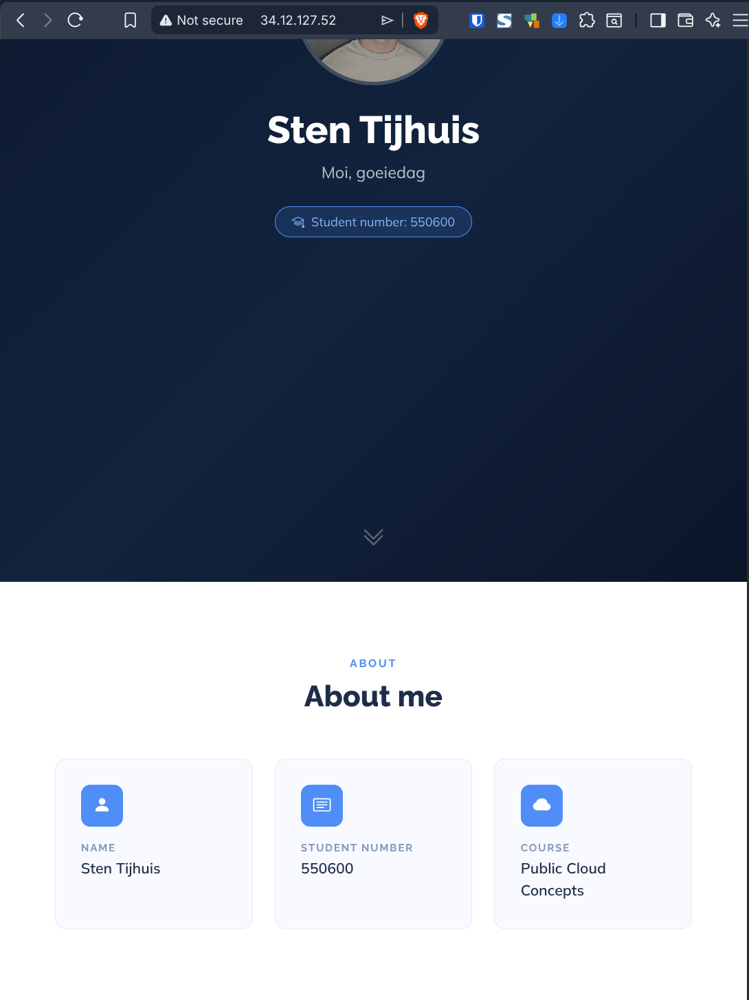

The full LoadBalancer flow on GKE: browser -> Google Cloud Load Balancer (`34.12.127.52`) -> GKE node -> `kube-proxy` -> ClusterIP -> pods.

---

### Assignment 2.2h - Ingress: multiple services via one load balancer

With a LoadBalancer service, every application needs its own external IP and load balancer. An **Ingress** solves this: one load balancer routes traffic to multiple services based on the hostname.

The goal is to expose two apps via a single Ingress:

| Hostname | Backend service |
|---|---|
| `bison.mysaxion.nl` | `bison-service` (port 80) |
| `brightspace.mysaxion.nl` | `brightspace-service` (port 80) |

#### Step 1 - Install the nginx Ingress Controller

```bash
kubectl apply -f https://raw.githubusercontent.com/kubernetes/ingress-nginx/controller-v1.12.0/deploy/static/provider/cloud/deploy.yaml
```

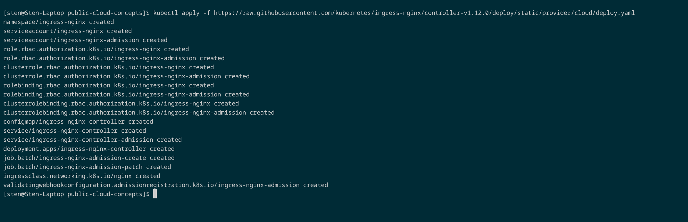

GKE automatically provisions a Google Cloud Load Balancer for the Ingress Controller. The external IP was watched until it appeared:

```bash
kubectl get service ingress-nginx-controller -n ingress-nginx
```

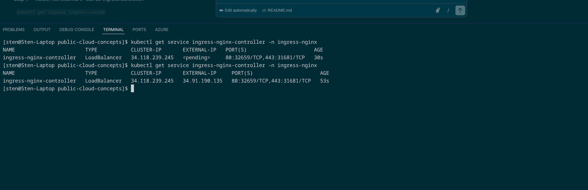

```
NAME                       TYPE           CLUSTER-IP       EXTERNAL-IP      PORT(S)                      AGE
ingress-nginx-controller   LoadBalancer   34.118.239.245   34.91.190.135    80:32659/TCP,443:31681/TCP   53s
```

#### Step 2 - Deploy bison, brightspace and the Ingress

```bash
kubectl apply -f "Week 2/bison/deployment.yml"
kubectl apply -f "Week 2/bison/service.yml"
kubectl apply -f "Week 2/brightspace/deployment.yml"
kubectl apply -f "Week 2/brightspace/service.yml"
kubectl apply -f "Week 2/ingress.yml"
```

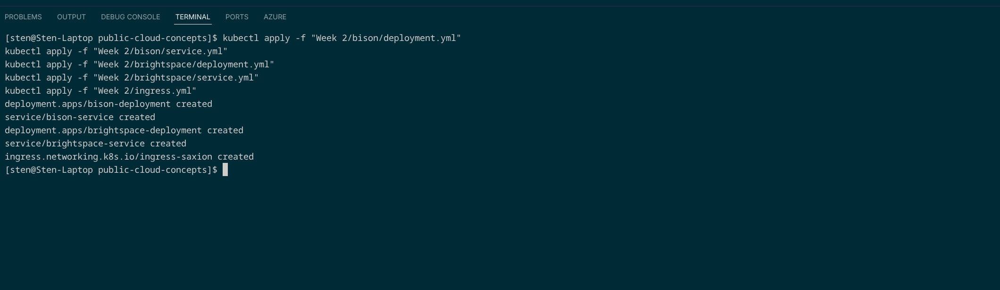

```
deployment.apps/bison-deployment created
service/bison-service created
deployment.apps/brightspace-deployment created
service/brightspace-service created
ingress.networking.k8s.io/ingress-saxion created
```

#### Step 3 - Verify the Ingress

```bash
kubectl get ingress ingress-saxion
```

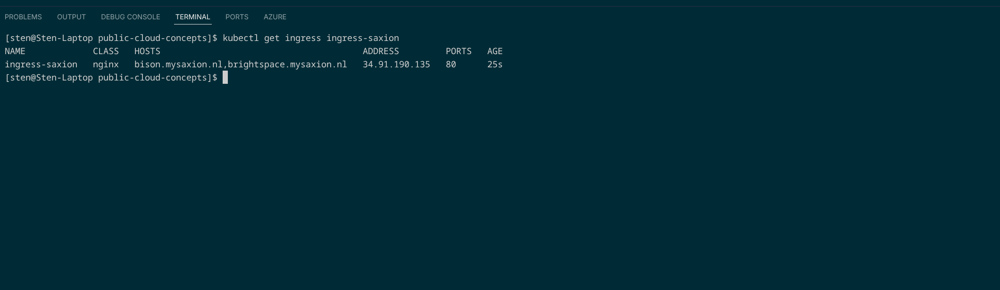

```
NAME             CLASS   HOSTS                                        ADDRESS          PORTS   AGE
ingress-saxion   nginx   bison.mysaxion.nl,brightspace.mysaxion.nl   34.91.190.135    80      25s
```

The Ingress has a single address (`34.91.190.135`) routing to both hostnames.

#### Step 4 - Update /etc/hosts

Since `bison.mysaxion.nl` and `brightspace.mysaxion.nl` are not real DNS records, they must be resolved locally via `/etc/hosts`:

```bash
echo "34.91.190.135  bison.mysaxion.nl brightspace.mysaxion.nl" | sudo tee -a /etc/hosts
```

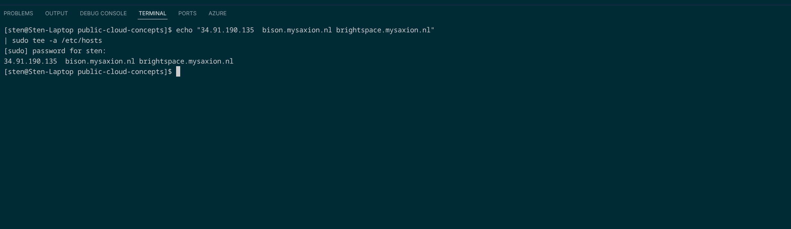

#### Step 5 - Browser test

Both hostnames now resolve to the Ingress Controller, which routes based on the `Host` header to the correct backend.

**bison.mysaxion.nl:**

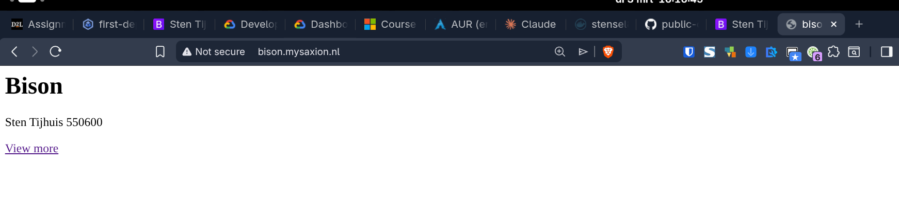

**brightspace.mysaxion.nl:**

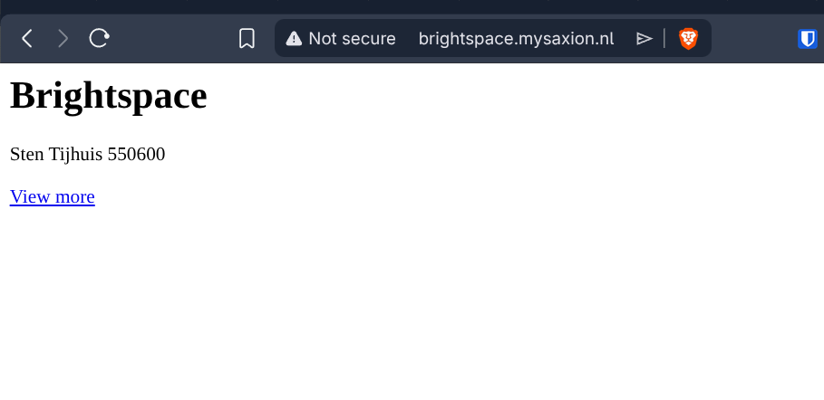

**Why Ingress?**

Without Ingress, two separate `LoadBalancer` services would be needed, each provisioning its own Google Cloud Load Balancer and external IP, which costs money and is harder to manage. The Ingress pattern uses a **single load balancer** (`34.91.190.135`) that routes traffic to the correct service based on the `Host` HTTP header. This is the standard way to expose multiple applications in Kubernetes.

The full Ingress flow: browser -> `34.91.190.135` (Google Cloud LB) -> nginx Ingress Controller pod -> `bison-service` or `brightspace-service` (ClusterIP) -> application pods.

---

| [← Week 1 - Introduction \& Deployments](../Week%201/README.en.md) | [Week 3 →](../Week%203/) |
|:---|---:|
