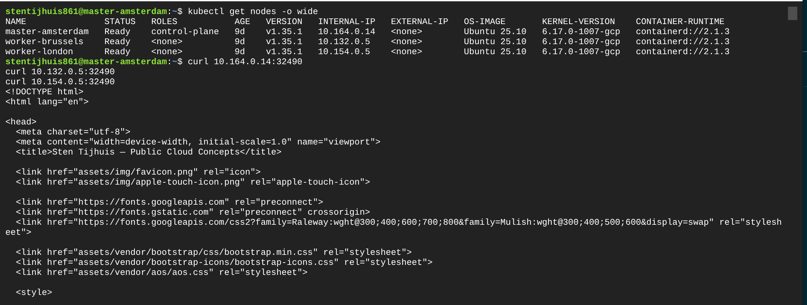

🇳🇱 Nederlands | [🇬🇧 English](README.en.md)

---

# Week 2 - Kubernetes Networking & CI/CD

## Onderwerpen

Deze week gaat het over **Kubernetes Networking**. We maken een Kubernetes Cluster in Google Cloud en leren hoe het **LoadBalancer** Service-type werkt.

---

## Leerdoelen

- [ ] Het Software Development Life Cycle (SDLC) analyseren
- [ ] DevOps-strategieen voor automatisering verkennen
- [ ] Een broncode-repository koppelen en applicaties bouwen vanuit Artifact Repositories
- [ ] CI/CD inrichten voor een DTAP-omgeving
- [ ] Kubernetes gebruiken in de cloud (GKE)
- [ ] Cloud Shell en `kubectl` gebruiken om met Kubernetes-clusters te werken
- [ ] Networking in Kubernetes begrijpen

---

## Leermaterialen

### DevOps & CI/CD

| Resource | Link |
|---|---|
| AWS Whitepaper - Practicing Continuous Integration and Continuous Delivery on AWS | [docs.aws.amazon.com (PDF)](https://docs.aws.amazon.com/whitepapers/latest/practicing-continuous-integration-continuous-delivery/welcome.html) |
| 2023 Accelerate State of DevOps Report | [cloud.google.com](https://cloud.google.com/blog/products/devops-sre/announcing-the-2023-state-of-devops-report) |
| DORA's Research Program | [dora.dev](https://dora.dev/research/) |

### Kubernetes & GKE

| Resource | Link |
|---|---|
| Google Kubernetes Engine documentatie | [cloud.google.com](https://cloud.google.com/kubernetes-engine/docs/#training-and-tutorials) |
| Getting Started with Kubernetes Engine | [github.com/GoogleCloudPlatform](https://github.com/GoogleCloudPlatform/qwiklabs-training-content/blob/master/labs/GCPFUND-Kubernetes/instructions/en.md) |
| Kubernetes Engine - Qwik Start (GSP100) | [cloudskillsboost.google](https://www.cloudskillsboost.google/catalog_lab/911?qlcampaign=77-18-gcpd-236&utm_source=gcp&utm_medium=documentation&utm_campaign=kubernetes) |

---

## Cursusdocumenten

| Document | Omschrijving |
|---|---|
| [Slides week 2 - Kubernetes Networking](Les%202%20Kubernetes%20networking%20ENG.pdf) | Theorie over Kubernetes networking |
| [Opdrachten week 2 v2](PCC/Assignments%20week%202%20v2.docx) | Opdrachten voor week 2 |

---

## Bestanden in Deze Map

| Bestand / Map | Beschrijving |
|---|---|
| [ingress.yml](ingress.yml) | Kubernetes Ingress manifest voor het routeren van extern verkeer |
| [bison/](bison/) | Deployment- en service-manifesten voor de Bison-applicatie |
| [brightspace/](brightspace/) | Deployment- en service-manifesten voor de Brightspace-applicatie |
| [PCC/](PCC/) | Extra projectbestanden en opdrachten |

---

# Mijn Werk

## CI/CD - Docker Hub Tags

De GitHub Actions workflow ([ci_week2.yml](../.github/workflows/ci_week2.yml)) bouwt twee images en pusht ze naar de bestaande `stensel8/public-cloud-concepts` DockerHub-repository met aparte tags:

| Image | Tag | Pull commando |
|-------|-----|---------------|
| Bison app | `bison` | `docker pull stensel8/public-cloud-concepts:bison` |
| Brightspace app | `brightspace` | `docker pull stensel8/public-cloud-concepts:brightspace` |


---

## 2.2 Kubernetes Uitdaging (deel 2)

### Opdracht 2.2a - Deployment draait

De Week 1 deployment (`first-deployment`) draait op het kubeadm-cluster met beide pods actief in twee regio's:


```
NAME               STATUS   ROLES           AGE   VERSION
master-amsterdam   Ready    control-plane   9d    v1.35.1
worker-brussels    Ready    <none>          9d    v1.35.1
worker-london      Ready    <none>          9d    v1.35.1

NAME                                READY   STATUS    RESTARTS      IP           NODE
first-deployment-5ffbd9444c-5hkzs   1/1     Running   1 (102s ago)  10.244.2.3   worker-london
first-deployment-5ffbd9444c-s4xdb   1/1     Running   1 (105s ago)  10.244.1.3   worker-brussels
```

---

### Opdracht 2.2b - Pod verwijderen en opnieuw aanmaken

Een pod werd verwijderd terwijl de Deployment actief bleef. Kubernetes maakte automatisch een vervangende pod aan met een **ander IP-adres**, wat aantoont dat pod-IPs tijdelijk zijn en geen stabiele identifiers.


```
# Voor verwijdering:
first-deployment-5ffbd9444c-5hkzs   IP: 10.244.2.3   worker-london

# Na verwijdering - nieuwe pod:
first-deployment-5ffbd9444c-pdrw0   IP: 10.244.2.4   worker-london
```

Het IP veranderde van `10.244.2.3` naar `10.244.2.4`. Dit is precies waarom je een Service nodig hebt: pods zijn wegwerpbaar en hun IPs veranderen. Een Service geeft een stabiel virtueel IP dat altijd naar de actieve pods routeert, ongeacht herstarts.

---

### Opdracht 2.2c - ClusterIP Service

Er is een Service van het type `ClusterIP` aangemaakt voor de deployment:

```yaml
apiVersion: v1
kind: Service
metadata:
  name: first-service
spec:
  type: ClusterIP
  selector:
    app: my-container
  ports:
    - port: 80
      targetPort: 80
```


```
NAME            TYPE        CLUSTER-IP      EXTERNAL-IP   PORT(S)   AGE
first-service   ClusterIP   10.110.23.98    <none>        80/TCP    0s
```

Het ClusterIP `10.110.23.98` is een stabiel virtueel IP dat door `kube-proxy` wordt beheerd. Het is alleen bereikbaar vanuit het cluster, niet van buiten. Verkeer naar dit IP wordt load-balanced over alle pods die overeenkomen met de selector `app: my-container`.

---

### Opdracht 2.2d - ClusterIP bereikbaar vanaf elke node

Het ClusterIP is getest vanaf alle drie de nodes. Alle nodes gaven de HTML-respons terug, wat bevestigt dat `kube-proxy` verkeer correct routeert ongeacht welke node het verzoek verstuurt.

**Vanaf master-amsterdam (`10.164.0.14`):**


**Vanaf worker-brussels (`10.132.0.5`):**


**Vanaf worker-london (`10.154.0.5`):**


Alle drie nodes bereikten de applicatie via `curl 10.110.23.98`, wat bewijst dat het ClusterIP clusterbreed bereikbaar is.

---

### Opdracht 2.2e - NodePort Service

De service is bijgewerkt naar type `NodePort`. Kubernetes wees poort `32490` toe op elke node:


```
NAME            TYPE       CLUSTER-IP      EXTERNAL-IP   PORT(S)        AGE
first-service   NodePort   10.110.23.98    <none>        80:32490/TCP   8m39s
```

**Interne IPs van de nodes:**


| Node | Intern IP |
|------|-----------|
| master-amsterdam | 10.164.0.14 |
| worker-brussels | 10.132.0.5 |
| worker-london | 10.154.0.5 |

**Interne curl-test via NodePort:**

De applicatie is bereikt vanuit het cluster via het interne IP van de node en NodePort `32490`:



```bash
curl 10.132.0.5:32490   # worker-brussels -> HTML response
curl 10.154.0.5:32490   # worker-london   -> HTML response
```

**Externe toegang - voor de firewallregel:**

Proberen de applicatie te bereiken via het externe IP (`34.140.10.158`) op poort `32490` vanuit een browser mislukte. De GCP-firewall blokkeerde het verkeer:


**Firewallregel aanmaken in GCP:**

In **VPC Network -> Firewall** is een firewallregel aangemaakt om inkomend TCP-verkeer op poort `32490` toe te staan voor alle instanties in het netwerk:


**Externe toegang - na de firewallregel:**

Na het toepassen van de firewallregel is de applicatie bereikbaar via een browser op `http://34.160.10.158:32490`:


Dit bevestigt de volledige NodePort-flow: extern verkeer -> extern node-IP -> poort 32490 -> `kube-proxy` -> ClusterIP -> pods.

> [!NOTE]
> De firewallregel was hier een **workaround**, geen standaard onderdeel van de NodePort-aanpak. Op een productiesysteem open je niet handmatig GCP-firewallregels per NodePort - dat schaalt slecht en leidt tot beveiligingsrisico's. De bedoelde oplossing voor extern bereikbare services is een `LoadBalancer` service (op een managed cluster zoals GKE) of een Ingress controller. De firewallregel is hier uitsluitend gebruikt om de NodePort-flow te demonstreren op een zelfbeheerd kubeadm-cluster zonder cloud controller manager.

---

### Opdracht 2.2f - LoadBalancer op het kubeadm-cluster

De service is bijgewerkt naar type `LoadBalancer`:


```
NAME            TYPE           CLUSTER-IP     EXTERNAL-IP   PORT(S)        AGE
first-service   LoadBalancer   10.110.23.98   <pending>     80:32490/TCP   26m
```

De `EXTERNAL-IP` blijft `<pending>`, ongeacht hoe vaak `kubectl get service` wordt uitgevoerd:


**Waarom blijft het pending?**

Een `LoadBalancer` service werkt door de **cloud controller manager** te vragen een externe load balancer te provisionen op het onderliggende cloudplatform en er een publiek IP aan toe te wijzen. Op een zelfbeheerd kubeadm-cluster op gewone GCP-VMs is er geen cloud controller manager aanwezig. Kubernetes heeft geen kennis van of integratie met de GCP-API. Er is geen component dat namens Kubernetes een load balancer kan aanvragen, dus het externe IP wordt nooit toegewezen en de service blijft `<pending>`.

Dit is het grote verschil met managed Kubernetes-diensten zoals **GKE**: GKE heeft de GCP cloud controller manager ingebouwd, die automatisch een Google Cloud Load Balancer provisioneert en een echt extern IP toewijst zodra je een `LoadBalancer` service aanmaakt.

#### Waarom is pending normaal gedrag op onze setup?

Op ons kubeadm-cluster draaien gewone GCP-VMs met Kubernetes dat handmatig is opgezet. Kubernetes zelf weet niets van GCP - er is geen cloud controller manager aanwezig die de GCP-API kan aanroepen. Het pending-gedrag is dus **volledig verwacht en correct**: Kubernetes wacht op een signaal dat nooit komt. Dit is geen fout, maar een logisch gevolg van de setup.

#### Samenvatting: Wat zijn de opties?

| Aanpak | Hoe | Wanneer |
|---|---|---|
| **Juiste manier** | Gebruik een managed cluster (GKE) - de cloud controller manager regelt automatisch een Load Balancer met extern IP | Productie, opdrachten 2.2g en verder |
| **NodePort + firewallregel** | Open handmatig een GCP-firewallregel voor de NodePort-poort | Workaround op kubeadm, alleen voor demo/test |
| **Ingress controller** | Installeer een nginx Ingress controller (zelf een LoadBalancer service op GKE) - routeert meerdere services via één extern IP | Meerdere apps achter één load balancer (opdracht 2.2h) |

> [!IMPORTANT]
> De firewallregel uit opdracht 2.2e was een **workaround** om externe toegang te demonstreren op het kubeadm-cluster. Het is geen vervanging voor een echte LoadBalancer en schaalt niet in productie. De docent wees er terecht op dat de bedoelde aanpak het gebruik van GKE is (opdracht 2.2g), waarbij de cloud controller manager automatisch een load balancer provisioneert zonder handmatige firewallaanpassingen.

---

### Opdracht 2.2g - LoadBalancer op GKE (echt extern IP)

#### GKE-cluster aanmaken

Een nieuw GKE-cluster `week2-cluster` is aangemaakt via de GCP Console (Kubernetes Engine -> Create cluster).

**Cluster basics** - naam `week2-cluster`, zone `europe-west4-a`, Standard mode, Regular release channel:


**Node pool - machine type** - `e2-medium` (2 vCPU, 4 GB geheugen), Standard persistent disk, 100 GB boot disk:


**Node pool - details** - pool naam `default-pool`, 2 nodes, control plane versie `1.34.3-gke.1318000`, zone `europe-west4-a`:


Na het klikken op Create ging het cluster in de provisioningfase:


```
Status: Provisioning   Mode: Standard   Nodes: 2   Zone: europe-west4-a
```

---

#### kubectl instellen voor GKE (CachyOS / Arch Linux)

Voordat je naar GKE kunt deployen, moet lokale `kubectl` verbonden worden met het GKE-cluster. De `gcloud` CLI was nog niet geinstalleerd, dus de volgende stappen zijn uitgevoerd:

**1. gcloud CLI installeren via AUR:**
```bash
paru -S google-cloud-cli
paru -S google-cloud-cli-component-gke-gcloud-auth-plugin
```

**2. Inloggen bij Google:**
```bash
gcloud auth login
```

**3. Project instellen:**
```bash
gcloud config set project project-5b8c5498-4fe2-42b9-bc3
```

**4. Cluster-credentials ophalen:**
```bash
gcloud container clusters get-credentials week2-cluster --zone europe-west4-a
```

**5. kubectl-verbinding controleren:**
```bash
kubectl get nodes
```


```
NAME                                           STATUS   ROLES    AGE    VERSION
gke-week2-cluster-default-pool-64557d8d-5zc7   Ready    <none>   5m     v1.34.3-gke.1318000
gke-week2-cluster-default-pool-64557d8d-qgcc   Ready    <none>   5m1s   v1.34.3-gke.1318000
```

Beide GKE-nodes zijn `Ready`. In tegenstelling tot het zelfbeheerde kubeadm-cluster heeft GKE de Google Cloud controller manager ingebouwd, waardoor een `LoadBalancer` service automatisch een echt extern IP krijgt.

#### Deployen naar GKE

De Week 1 deployment en LoadBalancer service zijn toegepast op het GKE-cluster:

```bash
kubectl apply -f "Week 1/deployment.yml"
kubectl apply -f "Week 1/service.yml"
```

Daarna is het externe IP gevolgd met herhaalde `kubectl get service first-service` aanroepen:


```
NAME            TYPE           CLUSTER-IP       EXTERNAL-IP     PORT(S)        AGE
first-service   LoadBalancer   34.118.232.196   <pending>       80:31275/TCP   0s
first-service   LoadBalancer   34.118.232.196   <pending>       80:31275/TCP   14s
first-service   LoadBalancer   34.118.232.196   34.12.127.52    80:31275/TCP   44s
```

Na ~44 seconden had GKE een **Google Cloud Load Balancer** geprovisioneert en het echte externe IP `34.12.127.52` toegewezen. Dit is het kernverschil met het zelfbeheerde kubeadm-cluster waar het externe IP permanent `<pending>` bleef. De cloud controller manager van GKE regelt de provisioning automatisch.

**Browser-test:**

Navigeren naar `http://34.12.127.52` in de browser bevestigt dat de applicatie publiek bereikbaar is via de GKE LoadBalancer:


De volledige LoadBalancer-flow op GKE: browser -> Google Cloud Load Balancer (`34.12.127.52`) -> GKE node -> `kube-proxy` -> ClusterIP -> pods.

---

### Opdracht 2.2h - Ingress: meerdere services via een load balancer

Met een LoadBalancer service heeft elke applicatie zijn eigen externe IP en load balancer nodig. Een **Ingress** lost dit op: een load balancer routeert verkeer naar meerdere services op basis van de hostnaam.

Het doel is twee apps beschikbaar stellen via een enkele Ingress:

| Hostnaam | Backend service |
|---|---|
| `bison.mysaxion.nl` | `bison-service` (poort 80) |
| `brightspace.mysaxion.nl` | `brightspace-service` (poort 80) |

#### Stap 1 - nginx Ingress Controller installeren

```bash
kubectl apply -f https://raw.githubusercontent.com/kubernetes/ingress-nginx/controller-v1.12.0/deploy/static/provider/cloud/deploy.yaml
```


GKE provisioneert automatisch een Google Cloud Load Balancer voor de Ingress Controller. Het externe IP is gevolgd totdat het verscheen:

```bash
kubectl get service ingress-nginx-controller -n ingress-nginx
```


```
NAME                       TYPE           CLUSTER-IP       EXTERNAL-IP      PORT(S)                      AGE
ingress-nginx-controller   LoadBalancer   34.118.239.245   34.91.190.135    80:32659/TCP,443:31681/TCP   53s
```

#### Stap 2 - bison, brightspace en de Ingress deployen

```bash
kubectl apply -f "Week 2/bison/deployment.yml"
kubectl apply -f "Week 2/bison/service.yml"
kubectl apply -f "Week 2/brightspace/deployment.yml"
kubectl apply -f "Week 2/brightspace/service.yml"
kubectl apply -f "Week 2/ingress.yml"
```


```
deployment.apps/bison-deployment created
service/bison-service created
deployment.apps/brightspace-deployment created
service/brightspace-service created
ingress.networking.k8s.io/ingress-saxion created
```

#### Stap 3 - Ingress controleren

```bash
kubectl get ingress ingress-saxion
```


```
NAME             CLASS   HOSTS                                        ADDRESS          PORTS   AGE
ingress-saxion   nginx   bison.mysaxion.nl,brightspace.mysaxion.nl   34.91.190.135    80      25s
```

De Ingress heeft een enkel adres (`34.91.190.135`) dat naar beide hostnamen routeert.

#### Stap 4 - /etc/hosts bijwerken

Omdat `bison.mysaxion.nl` en `brightspace.mysaxion.nl` geen echte DNS-records zijn, moeten ze lokaal worden opgelost via `/etc/hosts`:

```bash
echo "34.91.190.135  bison.mysaxion.nl brightspace.mysaxion.nl" | sudo tee -a /etc/hosts
```


#### Stap 5 - Browser-test

Beide hostnamen worden nu omgezet naar de Ingress Controller, die op basis van de `Host`-header naar de juiste backend routeert.

**bison.mysaxion.nl:**


**brightspace.mysaxion.nl:**


**Waarom Ingress?**

Zonder Ingress zou je twee aparte `LoadBalancer` services nodig hebben, elk met hun eigen Google Cloud Load Balancer en extern IP. Dat kost extra geld en is lastiger te beheren. Met het Ingress-patroon gebruik je een **enkele load balancer** (`34.91.190.135`) die verkeer naar de juiste service stuurt op basis van de `Host` HTTP-header. Dit is de standaardmanier om meerdere applicaties in Kubernetes beschikbaar te stellen.

De volledige Ingress-flow: browser -> `34.91.190.135` (Google Cloud LB) -> nginx Ingress Controller pod -> `bison-service` of `brightspace-service` (ClusterIP) -> applicatiepods.
