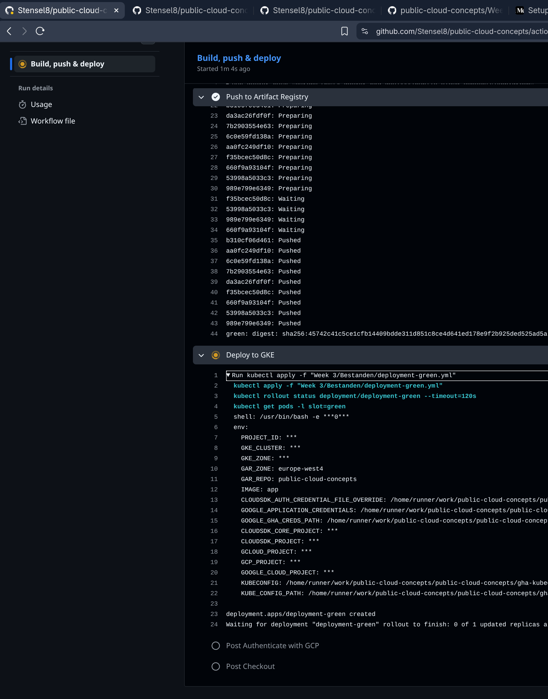
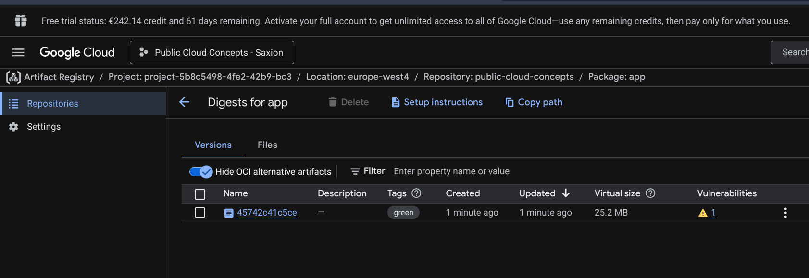

# Week 3 - Blue-Green Deployment & Artifact Registry

Voor week 3 is het de bedoeling dat ik een Blue-Green deployment opzet voor de eerder gecreëerde applicatie, maar dan met Google Artifact Registry als container registry in plaats van Docker Hub.

Daarnaast richt ik een CI/CD pipeline in met GitHub Actions die automatisch een nieuw image bouwt en uitrolt bij elke codeverandering.

---

## Blue-Green strategie

> [!NOTE]
> Bij een **Blue-Green deployment** draaien twee versies van de applicatie tegelijk in Kubernetes. Een Kubernetes Service stuurt al het verkeer naar één versie (de actieve slot). Overschakelen gaat zonder downtime door simpelweg de `selector` in de Service aan te passen.

| Slot | Branch | Docker image tag | Status |
|------|--------|-----------------|--------|
| 🔵 Blue | `main` | `blue` | Productie — ontvangt live verkeer |
| 🟢 Green | `development` | `green` | Test — draait parallel, ontvangt geen verkeer |

De branchnamen hoeven niet `blue` en `green` te heten — de kleur wordt bepaald door het label `slot: blue` of `slot: green` in de Kubernetes Deployment, en door welke selector de Service gebruikt.

---

## Stap 1: Kubernetes Cluster aanmaken

Eerst ruim ik de werkzaamheden van Week 1 op (de handmatig opgezette deployments op de virtuele machines). Als basis gebruik ik de omgeving van Week 2: een Google Kubernetes Engine cluster, wat beter geschikt is voor een Blue-Green deployment.


De week 2 omgeving draait nog, maar ik bouw hem opnieuw op als `week3-cluster` — dat is netter en overzichtelijker.


Net zoals bij Week 2 kies ik voor een **standaard cluster**. Dit geeft volledige controle over de configuratie en is goedkoop te houden voor deze opdracht.

**Instellingen:**


Ik kies voor **2 nodes** — het minimum dat nodig is voor een Blue-Green deployment.

Voor het machinetype kies ik **e2-medium** (2 vCPU's, 4 GB RAM). Voldoende voor de applicatie en nog steeds betaalbaar.


Het aanmaken van het cluster duurde ongeveer 5 minuten.


---

## Stap 2: Service Account aanmaken

Terwijl het cluster aangemaakt wordt, begin ik alvast met het opzetten van een Service Account waarmee GitHub Actions met GCP kan communiceren. Ik volg hiervoor deze handleiding:
[Setup CI/CD using GitHub Actions to deploy to GKE](https://medium.com/@gravish316/setup-ci-cd-using-github-actions-to-deploy-to-google-kubernetes-engine-ef465a482fd)


Het service account krijgt de volgende rollen:
- Artifact Registry Reader
- Artifact Registry Writer
- Kubernetes Engine Developer


---

## Stap 3: JSON Key aanmaken

Om de GitHub Actions workflow te kunnen authenticeren, maak ik een JSON key aan via **IAM → Service Accounts → Keys → Add Key → JSON**.


Bij het aanmaken van de key krijg ik de volgende foutmelding:


Een Organization Policy (`iam.disableServiceAccountKeyCreation`) blokkeert het aanmaken van keys.


In de GUI kan ik de policy niet aanpassen — daarvoor ontbreken de benodigde rechten.


### Oplossing via Cloud Shell

Via de CLI kan ik mezelf eerst de benodigde rechten geven en daarna de policy overrulen op projectniveau:

```bash
gcloud organizations add-iam-policy-binding 774668784967 \
  --member="user:stentijhuis861@gmail.com" \
  --role="roles/orgpolicy.policyAdmin"
```


```bash
gcloud resource-manager org-policies disable-enforce iam.disableServiceAccountKeyCreation \
  --project=project-5b8c5498-4fe2-42b9-bc3
```


De policy is nu uitgeschakeld op projectniveau (`booleanPolicy: {}`), waarna ik de key wel kan aanmaken.


---

## Stap 4: GitHub Secrets instellen

De JSON key en overige projectgegevens voeg ik toe als repository secrets in GitHub via **Settings → Secrets and variables → Actions**.


De volgende secrets zijn aangemaakt:


Vervolgens kan ik weer terug naar de gcloud CLI om verbinding te maken met het cluster.


Daarna naar de Artifact Registry om een repository aan te maken voor de container images. Ik kies dezelfde naam als mijn Docker Hub en GitHub repositories: `public-cloud-concepts`.


De instellingen heb ik grotendeels op de standaardwaarden gelaten.


Tot slot heb ik de **Container Scanning API** ingeschakeld. Dit deed ik in Week 1 en 2 ook al met Docker Scout — het geeft een mooi overzicht van kwetsbaarheden in de images.


Uiteindelijk na het uitvoeren van mijn Blue-Green deployment, ziet het Github Actions gedeelte er zo uit: 

Bij Google Cloud zie ik nu mijn applicatie erbij komen, want de registry us nu 25,2MB groot. 

