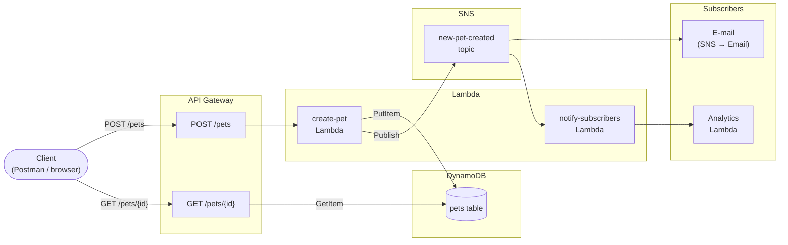

Week 7 focuses on serverless computing via AWS: a REST API with API Gateway (Petstore example), Lambda as a backend, and event-driven architectures using the Pub-Sub pattern.

---

## 7.1 REST API via API Gateway

### Creating the Petstore API

Via the AWS Console: **API Gateway → Create API → REST API → Import**. The Petstore example loads a ready-made OpenAPI definition with two endpoints: `GET /pets` and `POST /pets`.

After importing: **Deploy API** to a new stage (e.g. `dev`). The Invoke URL will look like:

```
https://<api-id>.execute-api.<region>.amazonaws.com/dev
```

**POST a pet via Postman:**

```http
POST https://<api-id>.execute-api.<region>.amazonaws.com/dev/pets
Content-Type: application/json

{
  "type": "dog",
  "price": 249.99
}
```

Response (201):

```json
{
  "petId": 42
}
```

**GET the created pet:**

```http
GET https://<api-id>.execute-api.<region>.amazonaws.com/dev/pets/42
```

Response:

```json
{
  "id": 42,
  "type": "dog",
  "price": 249.99
}
```

<!-- Add screenshots here from Postman: POST request and GET request with the generated ID -->

---

### Method and integration

In AWS API Gateway, a **method** and an **integration** are two distinct layers that together handle a request.

```
Client
  │
  ▼
Method Request       ← client-facing contract (HTTP method + path, auth, validation, request model)
  │
  ▼
Integration Request  ← transformation towards the backend (URL, headers, body mapping)
  │
  ▼
Backend              ← HTTP endpoint, Lambda, Mock, AWS Service, VPC Link
  │
  ▼
Integration Response ← transformation of the backend response (status codes, headers, body mapping)
  │
  ▼
Method Response      ← client-facing response (HTTP status codes, response models)
  │
  ▼
Client
```

**Method** — the client-facing side:

- Which HTTP verb + path the client calls (`POST /pets`)
- Which authentication is required (API Key, IAM, Cognito Authorizer, or none)
- Request validation: query parameters, headers, body schema
- Which HTTP status codes the client may receive

**Integration** — the backend-facing side:

- Where API Gateway forwards the request: an HTTP endpoint, a Lambda function, a Mock (no real backend), an AWS service, or a VPC Link
- How the request is transformed before forwarding (Integration Request mapping)
- How the backend response is transformed back to the client (Integration Response mapping)

These are two separate concerns that can be configured independently. You can secure the method with an API Key while the integration calls a Lambda function. You can also use a Mock integration to simulate an endpoint without a real backend — useful during development.

---

### Lambda as backend

Via the lab [Build an API Gateway REST API with Lambda integration](https://docs.aws.amazon.com/apigateway/latest/developerguide/api-gateway-create-api-as-simple-proxy-for-lambda.html):

1. Create a Lambda function (`HelloWorld` or a custom name) with a Node.js or Python runtime.
2. Create a new REST API in API Gateway.
3. Add a resource (`/hello`) with a `GET` method.
4. Choose **Lambda Function** as the integration type and select the Lambda function.
5. Deploy to a stage.

Lambda receives a **proxy event** from API Gateway and returns a structured object:

```json
{
  "statusCode": 200,
  "headers": { "Content-Type": "application/json" },
  "body": "{\"message\": \"Hello from Lambda!\"}"
}
```

With **Lambda Proxy Integration**, API Gateway forwards the full HTTP request as JSON to Lambda (method, headers, query parameters, body). Lambda is responsible for the full response including the statusCode. Without proxy integration, you can use mapping templates to transform requests and responses, but that requires more configuration.

<!-- Add screenshots here: Lambda function creation, API Gateway resource configuration, and the test response -->

---

## 7.2 Event-driven architectures

### Serverless and event-driven

Serverless computing and event-driven architectures are closely related: serverless functions do not run continuously, but are triggered by an **event**.

A traditional server actively waits for requests (polling or open connection). A serverless function essentially does not exist until an event occurs — the cloud provider instantiates the function when needed and removes it afterwards. This makes serverless inherently event-driven.

**What events trigger a Lambda function?**

| Event source | Example |
|---|---|
| HTTP request | API Gateway → POST /pets |
| Message | SQS queue, SNS topic |
| File upload | S3 PUT object |
| Schedule | EventBridge Scheduler (cron) |
| Database change | DynamoDB Streams |
| Another Lambda | Direct invocation |

In all cases the same pattern applies: **something happens → a function responds**. That is the essence of event-driven architectures. The functions are stateless, loosely coupled, and scale automatically with the number of events.

This also aligns with the **Twelve-Factor App** principle of loose coupling (factor 4: Backing services) and statelessness (factor 6: Processes). Each Lambda function is a process that stores no local state.

---

### Petstore with event-driven architecture

The Petstore application no longer needs to run as a single monolithic service. With an event-driven approach on AWS, the architecture looks as follows:



**Flow:**

1. Client sends `POST /pets` via API Gateway.
2. `create-pet` Lambda stores the pet in DynamoDB and publishes an event to an SNS topic (`new-pet-created`).
3. SNS delivers the event to all subscribers: an email subscription (direct notification) and a `notify-subscribers` Lambda (for further processing, e.g. analytics).

---

#### Design decision 1: SNS instead of direct email from Lambda

**Decision:** The `create-pet` Lambda publishes to an SNS topic instead of sending an email directly (e.g. via SES or an external mail service).

**Rationale:** If Lambda sends an email directly, the two responsibilities (storing + notifying) are coupled. If the email service is slow or unavailable, the Lambda blocks or fails. With SNS as an intermediary, the Lambda is done as soon as the event is published. SNS delivers the event asynchronously to all subscribers, independent of the Lambda.

SNS also enables **fan-out**: one event reaches multiple subscribers simultaneously (email, analytics, a future mobile push notification). Without SNS, every new subscriber would require changes to the Lambda code.

**Trade-off:** SNS guarantees at-least-once delivery, not exactly-once. The `notify-subscribers` Lambda must be idempotent: processing the same event twice must not result in duplicate analytics entries. This requires a deduplication mechanism (e.g. checking event ID in DynamoDB).

---

#### Design decision 2: DynamoDB as persistence layer

**Decision:** The pet data is stored in DynamoDB, not in a relational database (RDS).

**Rationale:** DynamoDB is serverless and event-driven: scaling is automatic and there are no idle costs (on-demand mode). An RDS instance runs continuously, even when there are no requests — that is a poor fit for a serverless API that may only be called occasionally.

DynamoDB also has **DynamoDB Streams**: every change to the table can trigger a Lambda function. This opens up an alternative architecture where the notification does not come from the `create-pet` Lambda, but from a stream processor listening to the DynamoDB stream. This keeps the `create-pet` Lambda responsible for one thing: storing.

**Trade-off:** DynamoDB is a key-value/document store. Complex queries (joins, aggregations) are harder than in SQL. For the Petstore this is not a problem — fetching by `petId` is a simple key lookup. If the Petstore later needs richer queries (all dogs under €100), DynamoDB + OpenSearch or a separate query service would be a better choice than migrating to RDS.
