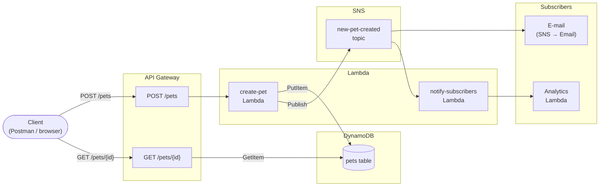

Week 7 richt zich op serverless computing via AWS: een REST API met API Gateway (Petstore-voorbeeld), Lambda als backend, en event-driven architecturen met het Pub-Sub patroon.

---

## 7.1 REST API via API Gateway

### Petstore API aanmaken

Via de AWS Console: **API Gateway → Create API → REST API → Import**. Het Petstore-voorbeeld laadt een kant-en-klare OpenAPI-definitie met twee endpoints: `GET /pets` en `POST /pets`.

Na het importeren: **Deploy API** naar een nieuwe stage (bijv. `dev`). De Invoke URL ziet er als volgt uit:

```
https://<api-id>.execute-api.<region>.amazonaws.com/dev
```

**POST een huisdier via Postman:**

```http
POST https://<api-id>.execute-api.<region>.amazonaws.com/dev/pets
Content-Type: application/json

{
  "type": "dog",
  "price": 249.99
}
```

Respons (201):

```json
{
  "petId": 42
}
```

**GET het aangemaakte huisdier:**

```http
GET https://<api-id>.execute-api.<region>.amazonaws.com/dev/pets/42
```

Respons:

```json
{
  "id": 42,
  "type": "dog",
  "price": 249.99
}
```

<!-- Voeg hier screenshots toe van Postman: POST-request en GET-request met het gegenereerde ID -->

---

### Method en integration

In AWS API Gateway zijn een **method** en een **integration** twee verschillende lagen die samen een request verwerken.

```
Client
  │
  ▼
Method Request       ← client-facing contract (HTTP method + pad, auth, validatie, request model)
  │
  ▼
Integration Request  ← transformatie naar de backend (URL, headers, body mapping)
  │
  ▼
Backend              ← HTTP endpoint, Lambda, Mock, AWS Service, VPC Link
  │
  ▼
Integration Response ← transformatie van de backend-respons (status codes, headers, body mapping)
  │
  ▼
Method Response      ← client-facing respons (HTTP status codes, response models)
  │
  ▼
Client
```

**Method** — de kant die de client ziet:

- Welk HTTP-werkwoord + pad de client aanroept (`POST /pets`)
- Welke authenticatie vereist is (API Key, IAM, Cognito Authorizer, of geen)
- Request-validatie: query parameters, headers, body schema
- Welke HTTP-statuscodes de client kan ontvangen

**Integration** — de kant die de backend ziet:

- Waar API Gateway de request naartoe stuurt: een HTTP-endpoint, een Lambda-functie, een Mock (geen echte backend), een AWS-service, of een VPC Link
- Hoe de request getransformeerd wordt vóór verzending (Integration Request mapping)
- Hoe de backend-respons getransformeerd wordt terug naar de client (Integration Response mapping)

Het zijn twee aparte verantwoordelijkheden die je onafhankelijk kunt configureren. Je kunt de methode beveiligen met een API Key terwijl de integration een Lambda-functie aanroept. Je kunt ook een mock integration gebruiken om een endpoint te simuleren zonder een echte backend, handig tijdens ontwikkeling.

---

### Lambda als backend

Via het lab [Build an API Gateway REST API with Lambda integration](https://docs.aws.amazon.com/apigateway/latest/developerguide/api-gateway-create-api-as-simple-proxy-for-lambda.html):

1. Maak een Lambda-functie aan (`GetStartedLambdaProxyIntegration`) met Python runtime.
2. Maak een nieuwe REST API aan in API Gateway.
3. Voeg een resource toe (`/helloworld`) met een `ANY`-method.
4. Kies **Lambda Function** als integration type, vink **Lambda Proxy Integration** aan, en selecteer de Lambda-functie.
5. Deploy naar een stage.

Lambda ontvangt een **proxy event** van API Gateway en retourneert een gestructureerd object:

```json
{
  "statusCode": 200,
  "headers": { "Content-Type": "application/json" },
  "body": "{\"message\": \"Hello from Lambda!\"}"
}
```

Met **Lambda Proxy Integration** stuurt API Gateway het volledige HTTP-request als JSON door naar Lambda (method, headers, query parameters, body). Lambda is verantwoordelijk voor de volledige response inclusief statusCode. Zonder proxy integration kun je mapping templates gebruiken om de request/response te transformeren, maar dat vereist meer configuratie.

### Lambda aanmaken

In het AWS Learner Lab kon ik geen nieuwe IAM-rol aanmaken — dat is een standaard studentbeperking. De oplossing was de bestaande **LabRole** gebruiken, die al de nodige rechten heeft voor Lambda en API Gateway.


Daarna de voorbeeldcode van de AWS-documentatie erin geplakt en gedeployed:


### API Gateway configureren

REST API aanmaken, resource `/helloworld` toevoegen, en de method instellen met Lambda Proxy Integration:


### Deployen

API deployen naar een nieuwe stage genaamd `test`:


De Invoke URL werd: `https://oubfrz862l.execute-api.us-east-1.amazonaws.com/test`

### Testen met HTTPie

Voor het testen heb ik [HTTPie](https://httpie.io/app) gebruikt in plaats van Postman. Ik gebruik dit vaker en vond het een goede kans om dat even te laten zien. HTTPie geeft requests en responses overzichtelijk weer en werkt lekker snel voor dit soort one-off tests.

De Lambda-functie accepteert drie varianten voor de `greeter`-waarde: via query parameter, via een header, of via een JSON-body. Alle drie zouden `Hello, {naam}!` terug moeten geven.

**Optie 1: query parameter**

Werkte meteen:


**Optie 2 en 3: header en POST-body**

Bij de eerste poging gaf API Gateway een `403 Forbidden` terug met de melding "Missing Authentication Token". Dat klinkt als een auth-probleem, maar dit is in API Gateway eigenlijk gewoon de default foutmelding als een route niet herkend wordt — of als de request niet goed is opgebouwd.


Na beter kijken bleek het een invoerfout aan mijn kant: de header-waarde klopte niet helemaal met wat de Lambda verwachtte. Na aanpassen werkten beide:


---

## 7.2 Event-driven architecturen

### Serverless en event-driven

Serverless computing en event-driven architecturen zijn nauw verwant: serverless functies draaien niet continu, maar worden geactiveerd door een **event**.

Een traditionele server wacht actief op requests (polling of open verbinding). Een serverless functie bestaat als het ware niet totdat er een event plaatsvindt — de cloudprovider instantieert de functie wanneer nodig en verwijdert hem daarna. Dit maakt serverless van nature event-driven.

**Welke events activeren een Lambda-functie?**

| Event source | Voorbeeld |
|---|---|
| HTTP request | API Gateway → POST /pets |
| Message | SQS queue, SNS topic |
| Bestandsupload | S3 PUT object |
| Tijdschema | EventBridge Scheduler (cron) |
| Databasewijziging | DynamoDB Streams |
| Andere Lambda | Direct invocation |

In alle gevallen geldt hetzelfde patroon: **iets gebeurt → een functie reageert**. Dat is de kern van event-driven architecturen. De functies zijn stateless, los gekoppeld, en schalen automatisch met het aantal events.

Dit past ook bij het **The Twelve-Factor App** principe van losse koppeling (factor 4: Backing services) en statelessheid (factor 6: Processes). Elke Lambda-functie is een proces dat geen lokale state bewaart.

---

### Petstore met event-driven architectuur

De Petstore-applicatie hoeft niet langer als één monolithische service te draaien. Met een event-driven aanpak op AWS ziet de architectuur er als volgt uit:



**Stroom:**

1. Client stuurt `POST /pets` via API Gateway.
2. `create-pet` Lambda slaat het huisdier op in DynamoDB en publiceert een event naar een SNS-topic (`new-pet-created`).
3. SNS verstuurt het event naar alle subscribers: een e-mailabonnement (directe notificatie) en een `notify-subscribers` Lambda (voor verdere verwerking, bijv. analytics).

---

#### Ontwerpbeslissing 1: SNS in plaats van directe e-mail vanuit Lambda

**Beslissing:** De `create-pet` Lambda publiceert naar een SNS-topic in plaats van rechtstreeks een e-mail te versturen (bijv. via SES of een externe mailservice).

**Redenering:** Als de Lambda rechtstreeks een e-mail verstuurt, zijn de twee verantwoordelijkheden (opslaan + notificeren) gekoppeld. Als de e-mailservice traag of onbereikbaar is, blokkeert of mislukt de Lambda. Met SNS als tussenstap is de Lambda klaar zodra het event gepubliceerd is. SNS bezorgt het event asynchroon aan alle subscribers, onafhankelijk van de Lambda.

Bovendien maakt SNS **fan-out** mogelijk: één event bereikt meerdere subscribers tegelijk (e-mail, analytics, een toekomstige mobiele pushnotificatie). Zonder SNS zou elke nieuwe subscriber de Lambda-code wijzigen.

**Trade-off:** SNS garandeert at-least-once delivery, niet exact-once. De `notify-subscribers` Lambda moet idempotent zijn: twee keer hetzelfde event verwerken mag niet leiden tot dubbele analytics-entries. Dit vereist een deduplicatiemechanisme (bijv. event ID controleren in DynamoDB).

---

#### Ontwerpbeslissing 2: DynamoDB als persistence-laag

**Beslissing:** De huisdierendata wordt opgeslagen in DynamoDB, niet in een relationele database (RDS).

**Redenering:** DynamoDB is serverless en event-driven: het schalen is automatisch en er is geen idle-kosten (on-demand mode). Een RDS-instance draait continu, ook als er geen requests zijn — dat past slecht bij een serverless API die misschien maar sporadisch aangesproken wordt.

DynamoDB heeft bovendien **DynamoDB Streams**: elke wijziging in de tabel kan een Lambda-functie triggeren. Dat opent een alternatieve architectuur waarbij de notificatie niet vanuit `create-pet` Lambda komt, maar vanuit een stream-verwerker die op de DynamoDB-stream luistert. Dit houdt de `create-pet` Lambda verantwoordelijk voor één ding: opslaan.

**Trade-off:** DynamoDB is een key-value/document store. Complexe queries (joins, aggregaties) zijn lastiger dan in SQL. Voor de Petstore is dat geen probleem — ophalen op `petId` is een eenvoudige key-lookup. Als de Petstore later rijkere zoekopdrachten nodig heeft (alle honden onder €100), is DynamoDB + OpenSearch of een aparte query-service een betere keuze dan overstappen naar RDS.
